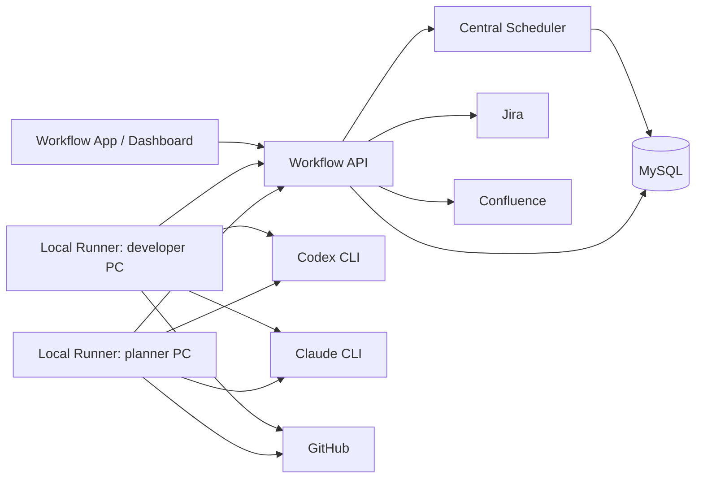

# Deployment and Migration Runbook

This runbook captures the current deployment shape, the target production
topology, and the MySQL migration procedure for the AI Workflow system.

## Current Status

The repository already contains:

- Workflow API entrypoints for the current PRD/document workflow slice.
- Local runner registration, heartbeat, claim, execution, and result APIs.
- MySQL schema migrations and repository implementations.
- Jira, GitHub, and Confluence integration clients.
- Secret redaction for runner logs, job results, error messages, artifact URIs,
  and metadata.

Important readiness note:

- `src/workflow-api/main.ts` supports `WORKFLOW_RUNTIME_STORE=memory` and
  `WORKFLOW_RUNTIME_STORE=mysql`.
- `memory` is the default fixture-backed local mode.
- `mysql` wires the runner/scheduler APIs and document artifact APIs to
  `MysqlWorkflowRepository` and `MysqlDocumentRepository`.
- The PRD/document workflow intake slice still uses the compatibility fixture
  for transitions, but state-changing API actions mirror the generic workflow
  snapshot into MySQL read-model tables.
- On API startup in MySQL mode, the compatibility fixture is hydrated from the
  MySQL read-model snapshot before HTTP routes are served.
- In MySQL mode, generic workflow/document GET views read workflow runs, jobs,
  documents, versions, quality results, artifacts, and feedback directly from
  the MySQL read model.
- PRD intake is also recorded through a MySQL write command for the initial
  workflow run, PRD document, and draft-generation job. Feedback storage and
  explicit revision requests are recorded through MySQL write commands for
  `feedback_item` and revision `workflow_job` rows. Approval state changes and
  downstream routing/fan-out/implementation scheduling are recorded through
  MySQL write commands for affected `document` and `workflow_job` rows.
  Engine-created document state changes and follow-up jobs are recorded through
  one command transaction during `/tick`, including an explicit engine
  transition type plus work item and external issue before/after state metadata
  and affected work item/document ids for later repository-backed engine
  migration. Runner result processing records a MySQL run projection for
  `workflow_job_result`, `document_version`, `artifact`, `quality_gate_result`,
  and current document pointers while the remaining transition logic still runs
  through the compatibility fixture.

## Target Topology



The central Workflow API owns workflow state, job claims, lease recovery,
retries, cancellation, and audit events. Local runners only execute jobs after
the central scheduler grants a claim that matches runner identity, owner scope,
project/repository allowlists, capabilities, and engine constraints.

n8n is not part of the target runtime. The Docker n8n services and exported
workflows remain in the repository only as historical migration reference.

## Runtime Roles

| Role | Responsibility | Current entrypoint |
| --- | --- | --- |
| Workflow App | Human-facing dashboard and control plane | `ui-execution-dashboard-demo` |
| Workflow API | Intake, state APIs, runner APIs, logs, events | `npm run start:api` |
| Scheduler | Claim, lease, retry, cancellation, recovery | In-process in current API fixture |
| MySQL | Target persistent workflow/document store | `docker compose --profile workflow-db up -d workflow-mysql` |
| Local Runner | Executes assigned jobs on a developer/planner PC | `npm run start:local-runner` |
| Jira | Source of truth for intake and approval status | `JIRA_*` env |
| GitHub | Implementation branch, PR, review/check status | `GITHUB_*` env |
| Confluence | Review/published document pages | `CONFLUENCE_*` env |

## Local Development Startup

Install dependencies:

```bash
npm install
```

Start the current Workflow API:

```bash
npm run start:api
```

Start the dashboard:

```bash
npm --prefix ui-execution-dashboard-demo install
npm --prefix ui-execution-dashboard-demo run dev
```

Start a local runner in another terminal:

```bash
cp .env.example .env
npm run start:local-runner
```

For a one-shot runner smoke test, set:

```bash
LOCAL_RUNNER_ONCE=true
```

## Local Runner Scope

Each local runner should be registered with the narrowest useful scope.

Recommended defaults:

```bash
LOCAL_RUNNER_ID=runner-yourname-laptop
LOCAL_RUNNER_OWNER_USER_ID=yourname@example.com
LOCAL_RUNNER_MODE=local
LOCAL_RUNNER_CAPABILITIES=document.generate,document.evaluate
LOCAL_RUNNER_ALLOWED_PROJECT_IDS=
LOCAL_RUNNER_ALLOWED_REPOSITORY_IDS=
LOCAL_RUNNER_TEAM_IDS=
LOCAL_RUNNER_CONCURRENCY=1
RUNNER_ENGINE=codex
```

Only PCs allowed to operate implementation PRs should add:

```bash
LOCAL_RUNNER_CAPABILITIES=document.generate,document.evaluate,implementation.open_pr,implementation.collect_pr_status
GITHUB_TOKEN=
GITHUB_OWNER=org
GITHUB_REPO=service-repo
GITHUB_DEFAULT_BASE_BRANCH=main
```

`RUNNER_ENGINE` can be `codex` or `claude` depending on the local machine and
the user's preferred CLI setup. Job templates can still constrain which engine
is allowed for a specific job.

## MySQL Startup

Start the local MySQL service:

```bash
docker compose --profile workflow-db up -d workflow-mysql
```

Required environment variables:

```bash
WORKFLOW_RUNTIME_STORE=mysql
WORKFLOW_JOB_LEASE_MS=30000
WORKFLOW_MYSQL_HOST=127.0.0.1
WORKFLOW_MYSQL_PORT=3306
WORKFLOW_MYSQL_DATABASE=ai_workflow
WORKFLOW_MYSQL_USER=ai_workflow
WORKFLOW_MYSQL_PASSWORD=ai_workflow
WORKFLOW_MYSQL_ROOT_PASSWORD=ai_workflow_root
```

Apply migrations:

```bash
npm run db:migrate:mysql
```

The migration runner records applied files in `schema_migration` and applies
each migration inside a transaction. There are no down migrations yet.

## Migration Procedure

Use this sequence for production-like environments:

1. Confirm the application version and the migration files to be deployed.
2. Take a database snapshot or backup.
3. Confirm the `WORKFLOW_MYSQL_*` environment variables point to the intended
   database.
4. Run `npm run db:migrate:mysql`.
5. Verify the migration ledger:

```sql
select version, name, applied_at
from schema_migration
order by version;
```

6. Verify core tables exist:

```sql
show tables like 'workflow_run';
show tables like 'workflow_job';
show tables like 'workflow_job_result';
show tables like 'workflow_event';
show tables like 'document';
show tables like 'document_version';
show tables like 'artifact';
show tables like 'quality_gate_result';
show tables like 'feedback_item';
```

7. Start or restart the Workflow API after migrations are complete. In MySQL
   mode, startup logs should include the restored work-item/job counts when
   snapshot rows are present.
8. Start local runners only after the API has passed smoke checks.

Rollback rule:

- Restore the pre-migration snapshot.
- Do not manually delete rows from `schema_migration` unless the database has
  already been restored to the matching schema state.

Compatibility rule:

- Prefer additive migrations while active workflow runs exist.
- Avoid changing the shape of runner job payloads without versioned adapters or
  a migration plan for pending jobs.

## Deployment Order

Recommended rollout order:

1. Deploy code artifacts.
2. Apply MySQL migrations.
3. Start one Workflow API instance.
4. Run API smoke checks.
5. Start or update the dashboard.
6. Start one scoped local runner with `LOCAL_RUNNER_ONCE=true`.
7. Remove `LOCAL_RUNNER_ONCE=true` and start normal runner polling.
8. Increase runner count only after claim, heartbeat, and result submission are
   visible in the event/log APIs.

## Smoke Checks

Current fixture-backed API checks:

```bash
curl -X POST http://127.0.0.1:3000/prd/intake \
  -H 'content-type: application/json' \
  -d '{"prdJiraKey":"PRD-100"}'

curl -X POST http://127.0.0.1:3000/tick

curl http://127.0.0.1:3000/state/PRD-100
```

Runner/API checks:

```bash
curl http://127.0.0.1:3000/workflow-runs/<runId>/events
curl http://127.0.0.1:3000/workflow-runs/<runId>/events?type=job.failed
```

GitHub implementation checks, when configured:

- A spec approval schedules `implementation.open_pr`.
- The local runner creates a `pull_request` artifact.
- The workflow schedules `implementation.collect_pr_status`.
- PR review/check status is visible in the current state and artifacts.

## Confluence Feedback Import

Confluence feedback collection is explicit-trigger based. The system does not
poll or subscribe to Confluence webhooks in v1.

Import footer comments and open inline comments for a document:

```bash
curl -X POST http://127.0.0.1:3000/documents/<documentId>/wiki-feedback \
  -H 'content-type: application/json' \
  -d '{"pageId":"999"}'
```

If `pageId` or `pageUrl` is omitted, the API uses the document's current wiki
artifact URL when available. Imported comments are stored as `feedback_item`
records with `source=wiki` and are deduplicated by Confluence comment id.

After import, create an explicit revision job:

```bash
curl -X POST http://127.0.0.1:3000/documents/<documentId>/revisions \
  -H 'content-type: application/json' \
  -d '{"requestedBy":"planner@example.com"}'
```

## Operational Events

Operators should monitor these workflow events:

| Event | Meaning | Expected metadata |
| --- | --- | --- |
| `job.retry_scheduled` | Retryable failure was rescheduled | `severity=warning`, `metric=workflow_job_retries_total` |
| `job.failed` | Final or non-retryable job failure | `severity=critical`, `alert=true`, `retryExhausted=true` |
| `job.lease_expired` | A claimed job exceeded its lease | `severity=warning`, `alert=true`, `metric=workflow_job_lease_expirations_total` |

Use:

```bash
curl http://127.0.0.1:3000/workflow-runs/<runId>/events?limit=50
```

## Credential Policy

Runtime credential environment variables are intentionally allowlisted.

Allowed credential keys:

- `JIRA_API_TOKEN`
- `CONFLUENCE_API_TOKEN`
- `GITHUB_TOKEN`
- `WORKFLOW_MYSQL_PASSWORD`
- `WORKFLOW_MYSQL_ROOT_PASSWORD`

Do not add new token/password environment variable names without updating:

- `src/runtime/secrets.ts`
- redaction tests
- `.env.example`
- this runbook

Secrets must not be written to runner logs, artifact URIs, artifact metadata,
job result output, or error messages. The current runtime redacts known secret
values, authorization headers, token query parameters, and common token-shaped
strings before storing runner-visible output.

## Production Readiness Gates

Before treating the system as production-backed, complete these gates:

- Replace the remaining compatibility fixture transition layer with repository
  backed workflow commands once the generic engine owns PRD/document state
  directly.
- Decide whether the scheduler remains in-process with the API or moves to a
  separate worker process.
- Add authentication and authorization for Workflow App and runner APIs.
- Decide whether environment variables remain the credential source or whether
  a secret manager becomes mandatory.
- Define backup, restore, and retention policy for MySQL.
- Define alert routing for `job.failed` and `job.lease_expired`.
- Confirm real Jira project fields and transition ids before enabling
  writeback.
- Confirm Confluence parent page ids per document type.
- Confirm GitHub token scope and repository allowlist per runner group.
