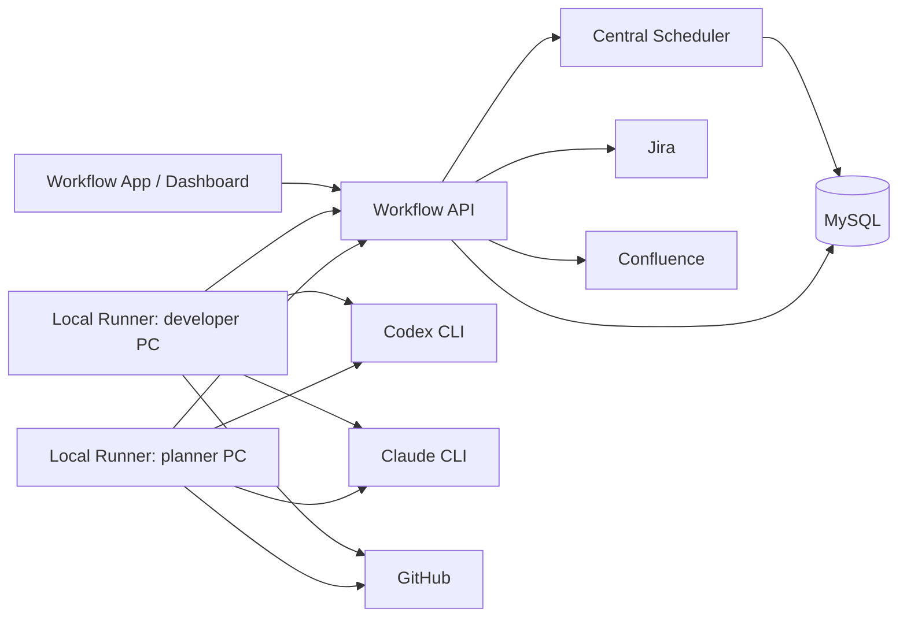

# Deployment and Migration Runbook

This runbook captures the current deployment shape, the target production
topology, and the MySQL migration procedure for the AI Workflow system.

## Current Status

The repository already contains:

- Workflow API entrypoints for the current PRD/document workflow slice.
- Local runner registration, heartbeat, claim, execution, and result APIs.
- Runner registry visibility through `GET /runners` for dashboard and operator
  checks.
- MySQL schema migrations and repository implementations.
- Jira, GitHub, and Confluence integration clients.
- Secret redaction for runner logs, job results, error messages, artifact URIs,
  and metadata.

Important readiness note:

- `src/workflow-api/main.ts` supports `WORKFLOW_RUNTIME_STORE=memory` and
  `WORKFLOW_RUNTIME_STORE=mysql`.
- `memory` is the default fixture-backed local mode.
- `mysql` wires the runner/scheduler APIs and document artifact APIs to
  `MysqlWorkflowRepository` and `MysqlDocumentRepository`.
- `WORKFLOW_COMPATIBILITY_FIXTURE=disabled` is supported only with
  `WORKFLOW_RUNTIME_STORE=mysql`. In that mode, runner APIs plus generic
  workflow/document/approval GET views run without the legacy PRD fixture.
  Repository-backed PRD intake, document feedback, wiki-feedback import,
  explicit revision, and approval approve/reject/refresh POST routes also run
  without the fixture when the Jira reader, read model, and command writers are
  configured. Compatibility-engine endpoints return `501` until the
  repository-backed transition engine replaces them.
- The PRD/document workflow intake slice still uses the compatibility fixture
  for transitions. While that fixture is enabled, the API process advances it
  with an internal workflow tick loop and state-changing actions mirror the
  generic workflow snapshot into MySQL read-model tables.
- `WORKFLOW_INTERNAL_TICK_MS` controls the compatibility tick loop. It defaults
  to `1000` ms when the fixture is enabled; set it to `0` or `disabled` to use
  only the manual development/test `POST /tick` trigger.
- `WORKFLOW_REPOSITORY_TRANSITION_MS` controls the repository-backed runner
  result transition loop when the compatibility fixture is disabled. It
  defaults to `1000` ms in MySQL no-fixture mode; set it to `0` or `disabled`
  when a separate worker process owns result transitions.
- `WORKFLOW_REPOSITORY_TRANSITION_WORKER_ID` and
  `WORKFLOW_REPOSITORY_TRANSITION_LEASE_MS` identify repository transition
  workers and control the MySQL claim lease for pending runner results.
- `WORKFLOW_RUNNER_OFFLINE_AFTER_MS` controls when a runner is shown and
  treated as offline after its last heartbeat. It defaults to twice
  `WORKFLOW_JOB_LEASE_MS`.
- `WORKFLOW_SCHEDULER_RECOVERY_MS` controls the in-process scheduler loop that
  recovers expired claimed/running job leases. It defaults to `1000` ms when a
  MySQL scheduler is configured; set it to `0` or `disabled` only if another
  scheduler process owns lease recovery.
- On API startup in MySQL mode, the compatibility fixture is hydrated from the
  MySQL read-model snapshot before HTTP routes are served.
- In MySQL mode, the PRD state view plus generic workflow/document/approval
  gate GET views read workflow runs, jobs, documents, versions, quality
  results, artifacts, feedback, and approval gate status directly from the
  MySQL read model. Missing PRD state returns `404` instead of falling back to
  the compatibility fixture.
- PRD intake is guarded by Jira status and only starts from `prd_requested`
  or the Jira display status `PRD 요청`; unreadable PRD/source tickets return
  `404`, missing linked source requests return `400`, and other PRD statuses
  return `409`.
- PRD intake, feedback/revision requests, approval/routing/fan-out job
  scheduling, compatibility engine transition projection, and runner result
  projection now produce `WorkflowMutation` objects that are applied by
  `MysqlWorkflowMutationApplier` in one transaction. This shared path owns the
  MySQL upsert/event insert order for workflow runs, documents, jobs, job
  results, document versions, artifacts, quality results, feedback, and current
  document pointers while the remaining transition logic still runs through the
  compatibility fixture.
- With the compatibility fixture disabled, document-scoped feedback/revision
  actions and the PRD feedback-revision shortcut build feedback items and
  revision jobs directly from the MySQL read model and record them through the
  shared command writer. Approval approve/reject actions update document state
  through the command writer, PRD approval schedules the downstream routing job,
  and explicit HLD/LLD fan-out requests create `document.fan_out` jobs without
  fixture state. These read-model-backed scheduling paths preserve the fixture
  idempotency behavior: repeated approval or fan-out requests return
  `already_scheduled` when a matching route/fan-out/implementation job already
  exists, and HLD/LLD ADR requests create an ADR-only fan-out only after a
  standard fan-out already exists without ADR coverage.
- Approval gate `refresh` in no-fixture mode also advances approved read-model
  documents: if a PRD/HLD/LLD/Spec document is already `approved`, refresh
  schedules the appropriate downstream route, fan-out, or implementation job
  through the same idempotent command path.
- Repository-backed implementation transitions close the workflow run only
  when `implementation.collect_pr_status` observes a merged PR and all Code
  tasks in the run are completed after that transition. The run status update
  is recorded through the shared mutation applier together with the final
  completed Code task and pull request artifact snapshot.
- With real integration config, PRD intake loads the PRD and linked source
  requests through the Jira reader, validates the same requested-status/source
  requirements as the fixture workflow, and records the initial run/document/job
  through the shared command writer.
- With the compatibility fixture disabled, runner result submission and the
  internal repository transition loop now plan repository-backed transitions
  for PRD/document generate, evaluate, revise, downstream routing, fan-out, and
  implementation PR status jobs, then record the resulting `WorkflowMutation`
  through the transition command. The loop reads terminal job results that do
  not yet have a matching `workflow.engine_transition` event for
  `processedResult.resultId`. When the loop is enabled, runner result requests
  only persist the result and the loop owns workflow state transitions to avoid
  duplicate processing. If the loop is disabled, the API keeps request-time
  transition processing as a fallback. The same transition core can run as
  `npm run start:repository-transition-worker`. Multiple workers share the
  MySQL `workflow_transition_claim` lease table; the reader retries after a
  lost claim race so one polling wave can still claim later visible results,
  and the automated tests cover an 8-worker contention scenario. Successfully
  applied transitions mark their claim row as `processed`.

## Target Topology



The central Workflow API owns workflow state, job claims, lease recovery,
retries, cancellation, runner concurrency, and audit events. Local runners only
execute jobs after the central scheduler grants a claim that matches runner
identity, owner scope, project/repository allowlists, capabilities, and engine
constraints.

n8n is not part of the target runtime. The Docker n8n services and exported
workflows remain in the repository only as historical migration reference.

## Runtime Roles

| Role | Responsibility | Current entrypoint |
| --- | --- | --- |
| Workflow App | Human-facing dashboard and control plane | `ui-execution-dashboard-demo` |
| Workflow API | Intake, state APIs, runner APIs, logs, events | `npm run start:api` |
| Scheduler | Claim, lease, retry, cancellation, recovery | In-process in current API fixture |
| Repository Transition Worker | Processes completed runner results into workflow transitions | `npm run start:repository-transition-worker` |
| MySQL | Target persistent workflow/document store | `docker compose --profile workflow-db up -d workflow-mysql` |
| Local Runner | Executes assigned jobs on a developer/planner PC | `npm run start:local-runner` |
| Jira | Source of truth for intake and approval status | `JIRA_*` env |
| GitHub | Implementation branch, PR, review/check status | `GITHUB_*` env |
| Confluence | Review/published document pages | `CONFLUENCE_*` env |

## Local Development Startup

Install dependencies:

```bash
npm install
```

Start the current Workflow API:

```bash
npm run start:api
```

Start the dashboard:

```bash
npm --prefix ui-execution-dashboard-demo install
npm --prefix ui-execution-dashboard-demo run dev
```

Start a local runner in another terminal:

```bash
cp .env.example .env
npm run start:local-runner
```

For a one-shot runner smoke test, set:

```bash
LOCAL_RUNNER_ONCE=true
```

For a local end-to-end drain check, set a job limit instead:

```bash
LOCAL_RUNNER_MAX_JOBS=5
```

The runner will register, heartbeat, claim and execute eligible jobs one after
another, then exit when it reaches idle or the configured limit.

## Identity and Optional Auth

The MVP treats user email as the primary human identity. Workflow App requests
should send `requestedBy`, `actor`, or `author` with the current user's email,
and local runners should set `LOCAL_RUNNER_OWNER_EMAIL` to the owner email.
The runner API also accepts `ownerEmail` as an alias for the stored
`ownerUserId` field. That is enough for assignment, audit trails, dashboard
attribution, and local runner scope checks. New PRD intake jobs are assigned to
the requester email, so a local runner only claims them when its owner email
matches. A local runner without an owner email is not eligible to claim jobs,
and the local runner CLI fails fast if `LOCAL_RUNNER_OWNER_EMAIL` is missing in
local mode. The dashboard exposes this as an Actor email field and uses it for
intake, feedback, revision, and approval actions. The dashboard also reads the
workflow run event ledger and includes actor/requester metadata in the Status
Events view when those events are available.

Bearer auth is optional for localhost/email-only development and enabled only
by configuration. When `WORKFLOW_APP_API_TOKEN` is set, Workflow
App/control-plane calls such as intake, state reads, approval actions,
cancellation, and manual tick endpoints must send
`Authorization: Bearer <app-token>`.

Runner APIs can be bound to runner identity with `WORKFLOW_RUNNER_TOKENS`.
Use comma-separated `runnerId:token` pairs or a JSON object. Runner
registration, heartbeat, claim, and runner job callbacks must send the token
for the same runner id they register, address in the URL, or submit in the
request body.

```bash
WORKFLOW_APP_API_TOKEN=
WORKFLOW_RUNNER_TOKENS=
LOCAL_RUNNER_ID=runner-yourname-laptop
LOCAL_RUNNER_OWNER_EMAIL=yourname@example.com
LOCAL_RUNNER_TOKEN=
```

If runner tokens are configured, unknown runner ids are rejected before they can
register. If only the app token is configured, runner APIs accept the app token
as a development fallback.

## Local Runner Scope

Each local runner should be registered with the narrowest useful scope.

Recommended defaults:

```bash
LOCAL_RUNNER_ID=runner-yourname-laptop
LOCAL_RUNNER_TOKEN=
LOCAL_RUNNER_OWNER_EMAIL=yourname@example.com
LOCAL_RUNNER_MODE=local
LOCAL_RUNNER_CAPABILITIES=document.generate,document.evaluate
LOCAL_RUNNER_ALLOWED_PROJECT_IDS=
LOCAL_RUNNER_ALLOWED_REPOSITORY_IDS=
LOCAL_RUNNER_TEAM_IDS=
LOCAL_RUNNER_CONCURRENCY=1
LOCAL_RUNNER_WORKSPACE_ROOT=.runner-workspaces
RUNNER_ENGINE=codex
```

Only PCs allowed to operate implementation PRs should add:

```bash
LOCAL_RUNNER_CAPABILITIES=document.generate,document.evaluate,implementation.open_pr,implementation.update_pr,implementation.collect_pr_status
GITHUB_TOKEN=
GITHUB_OWNER=org
GITHUB_REPO=service-repo
GITHUB_DEFAULT_BASE_BRANCH=main
GITHUB_CLONE_URL=https://github.com/org/service-repo.git
```

`RUNNER_ENGINE` can be `codex` or `claude` depending on the local machine and
the user's preferred CLI setup. Job templates can still constrain which engine
is allowed for a specific job.

Run the local runner doctor before starting the runner on a new PC:

```bash
npm run doctor:local-runner
```

The doctor command does not claim work. It checks the Workflow API URL, runner
id, owner email, capability and engine scope, required Claude/Codex CLI command,
GitHub settings for implementation capabilities, and workspace writability.
Fix every `failed` check before running `npm run start:local-runner`; `warning`
means the runner can start but is missing an operational nicety such as an
isolated workspace root.

Each claimed job gets its own directory under `LOCAL_RUNNER_WORKSPACE_ROOT`.
When a job template sets `runner.workdir`, the runner creates that subdirectory
inside the isolated job workspace before launching Codex/Claude. Paths that
escape the job workspace are rejected.

For `implementation.update_pr`, Git must be available on `PATH`. When GitHub
PR status includes a `repositoryCloneUrl` and `branchName`, the local runner
clones that PR branch into the job template workdir before launching the CLI
agent. If either field is missing, the job is failed and retried through the
normal scheduler policy instead of running against an empty directory.

The CLI bridge gives `implementation.update_pr` a code-rework prompt, not a
document-generation prompt. The agent is expected to apply the smallest code
fix on the checked-out branch, run relevant tests when practical, commit and
return JSON containing the PR number, PR URL, summary, and latest commit SHA
when known. After the CLI returns, the local runner pushes the checked-out PR
branch to `origin` before the workflow schedules the next PR status collection.
Those expectations live in the `implementation.pr-updater` runner skill
package under `skills/`, and the update job output/artifacts carry that skill
id for auditability.

When `GITHUB_CLONE_URL` and `LOCAL_RUNNER_WORKSPACE_ROOT` are configured, the
initial `implementation.open_pr` job also runs as a code implementation job:
the local runner clones the implementation repo, checks out the workflow branch,
runs the CLI agent in `implementation/`, pushes the branch to `origin`, then
opens the GitHub PR. Without a clone URL or isolated workspace it falls back to
the lightweight GitHub PR creation path.
For the code-backed path, the CLI agent is expected to return
`pullRequestTitle` and `pullRequestBody`. The local runner uses that AI-written
PR text when opening GitHub, and falls back to the scheduled job template only
when those fields are absent.
Those expectations live in the `implementation.pr-author` runner skill package
under `skills/`; it tells Codex/Claude to implement, test, commit locally, and
return reviewer-ready PR title/body JSON. The runner still owns the actual
GitHub PR creation.

Keep `LOCAL_RUNNER_CONCURRENCY=1` unless the local machine can safely run
multiple code-agent processes in parallel. The scheduler checks active
claimed/running/cancel-requested jobs before issuing another claim to the same
runner.

If a local runner prints `status=idle`, inspect `claimReason`, `claimMessage`,
and `nearestBlocker` in the JSON log. These values come from the scheduler
claim diagnostics and distinguish stale heartbeat, disabled runner,
concurrency capacity, no available jobs, and pending jobs that do not match the
runner's owner/scope/capability/engine.

The same diagnostics are exposed on `GET /runners` for dashboard/operator
views, including `claim_available` when a runner has eligible work waiting.
Capacity-full online runners are shown as `busy` in the runner list.

Operator pause/resume controls:

```bash
POST /runners/{runnerId}/pause
POST /runners/{runnerId}/resume
```

Pause stores the runner as `disabled`; claim diagnostics then return
`runner_disabled`, and heartbeat or repeated registration keeps the runner
disabled. Only the explicit resume action moves the runner back to `online`.
When `WORKFLOW_APP_API_TOKEN` is configured, these pause/resume actions use the
app/control-plane token rather than the per-runner callback token.

## MySQL Startup

Start the local MySQL service:

```bash
docker compose --profile workflow-db up -d workflow-mysql
```

Required environment variables:

```bash
WORKFLOW_RUNTIME_STORE=mysql
WORKFLOW_JOB_LEASE_MS=30000
WORKFLOW_RUNNER_OFFLINE_AFTER_MS=60000
WORKFLOW_SCHEDULER_RECOVERY_MS=1000
WORKFLOW_REPOSITORY_TRANSITION_MS=1000
WORKFLOW_REPOSITORY_TRANSITION_WORKER_ID=repository-transition-worker
WORKFLOW_REPOSITORY_TRANSITION_LEASE_MS=30000
WORKFLOW_MYSQL_HOST=127.0.0.1
WORKFLOW_MYSQL_PORT=3306
WORKFLOW_MYSQL_DATABASE=ai_workflow
WORKFLOW_MYSQL_USER=ai_workflow
WORKFLOW_MYSQL_PASSWORD=ai_workflow
WORKFLOW_MYSQL_ROOT_PASSWORD=ai_workflow_root
```

Apply migrations:

```bash
npm run db:migrate:mysql
```

The migration runner records applied files in `schema_migration` and applies
each migration inside a transaction. There are no down migrations yet.

## Migration Procedure

Use this sequence for production-like environments:

1. Confirm the application version and the migration files to be deployed.
2. Take a database snapshot or backup.
3. Confirm the `WORKFLOW_MYSQL_*` environment variables point to the intended
   database.
4. Run `npm run db:migrate:mysql`.
5. Verify the migration ledger:

```sql
select version, name, applied_at
from schema_migration
order by version;
```

6. Verify core tables exist:

```sql
show tables like 'workflow_run';
show tables like 'workflow_job';
show tables like 'workflow_job_result';
show tables like 'workflow_event';
show tables like 'document';
show tables like 'document_version';
show tables like 'artifact';
show tables like 'quality_gate_result';
show tables like 'feedback_item';
show tables like 'workflow_transition_claim';
```

7. Start or restart the Workflow API after migrations are complete. In MySQL
   mode, startup logs should include the restored work-item/job counts when
   snapshot rows are present.
8. Start local runners only after the API has passed smoke checks.

To run repository-backed result transitions outside the API process, start the
API with `WORKFLOW_REPOSITORY_TRANSITION_MS=0` and run a separate worker process
with MySQL no-fixture runtime enabled:

```bash
WORKFLOW_RUNTIME_STORE=mysql \
WORKFLOW_COMPATIBILITY_FIXTURE=disabled \
WORKFLOW_REPOSITORY_TRANSITION_MS=1000 \
WORKFLOW_REPOSITORY_TRANSITION_WORKER_ID=transition-worker-a \
npm run start:repository-transition-worker
```

For a one-shot smoke check, add:

```bash
WORKFLOW_REPOSITORY_TRANSITION_ONCE=true
```

Operational checks:

```sql
select status, count(*)
from workflow_transition_claim
group by status;
```

`claimed` rows with expired `lease_expires_at` can be retried by another
worker. `processed` rows indicate a transition was applied successfully.

Rollback rule:

- Restore the pre-migration snapshot.
- Do not manually delete rows from `schema_migration` unless the database has
  already been restored to the matching schema state.

Compatibility rule:

- Prefer additive migrations while active workflow runs exist.
- Avoid changing the shape of runner job payloads without versioned adapters or
  a migration plan for pending jobs.

## Deployment Order

Recommended rollout order:

1. Deploy code artifacts.
2. Apply MySQL migrations.
3. Start one Workflow API instance.
4. Run API smoke checks.
5. Start or update the dashboard.
6. Start one scoped local runner with `LOCAL_RUNNER_ONCE=true`.
7. Remove `LOCAL_RUNNER_ONCE=true` and start normal runner polling.
8. Increase runner count only after claim, heartbeat, and result submission are
   visible in the event/log APIs.

## Smoke Checks

Current fixture-backed API checks:

```bash
curl -X POST http://127.0.0.1:3000/prd/intake \
  -H 'content-type: application/json' \
  -d '{"prdJiraKey":"PRD-100"}'

curl http://127.0.0.1:3000/state/PRD-100
```

The fixture-backed API normally advances through its internal tick loop. Use
`POST /tick` only for development/test harnesses or when
`WORKFLOW_INTERNAL_TICK_MS=0`.

MySQL no-fixture smoke can use stub Jira data for local checks:

```bash
npm run smoke:mysql:no-fixture
```

The smoke command applies migrations unless `SMOKE_SKIP_MIGRATIONS=true`, then
starts an in-process API with `WORKFLOW_RUNTIME_STORE=mysql`,
`WORKFLOW_COMPATIBILITY_FIXTURE=disabled`, and repository transitions processed
inline. It intakes a unique `PRD-SMOKE-*` stub PRD, registers a scoped local
runner, drains PRD generation/evaluation, approves the PRD, drains downstream
routing plus HLD generation/evaluation, approves the HLD, drains LLD fan-out
and generation/evaluation, approves the LLDs, drains Spec fan-out and
generation/evaluation, approves the Specs, then drains implementation PR
creation and PR status collection. The final smoke verifies the PRD, HLD, LLD,
and Spec documents are approved and that pull request artifacts were recorded
for the generated Specs.

Useful overrides:

```bash
SMOKE_ACTOR_EMAIL=yourname@example.com
SMOKE_RUNNER_ID=runner-smoke-local
SMOKE_PRD_JIRA_KEY=PRD-SMOKE-MANUAL-1
SMOKE_SKIP_MIGRATIONS=false
```

By default, implementation jobs inside the smoke use deterministic stub PR
artifacts. To exercise the real GitHub-backed implementation path, opt in
explicitly:

```bash
SMOKE_IMPLEMENTATION_MODE=github
GITHUB_TOKEN=...
GITHUB_OWNER=acme
GITHUB_REPO=workflow-app
GITHUB_CLONE_URL=https://github.com/acme/workflow-app.git
LOCAL_RUNNER_WORKSPACE_ROOT=.runner-workspaces
RUNNER_ENGINE=codex
```

In GitHub smoke mode, document generation/evaluation remains deterministic,
but `implementation.open_pr`, `implementation.update_pr`, and
`implementation.collect_pr_status` are routed through the same local GitHub
implementation runner used by developer PCs.
In default stub mode, implementation status collection returns a deterministic
merged PR signal, so the smoke verifies both pull request artifacts and the
final `workflow_run` / Code task completion state without contacting GitHub.

Manual equivalent when a no-fixture API is already running:

```bash
curl -X POST http://127.0.0.1:3000/prd/intake \
  -H 'content-type: application/json' \
  -d '{"prdJiraKey":"PRD-100","requestedBy":"yourname@example.com"}'
```

With `LOCAL_RUNNER_OWNER_EMAIL=yourname@example.com`, a separate
`LOCAL_RUNNER_MAX_JOBS=5 npm run start:local-runner` process should register,
heartbeat, claim only that assigned work, and keep processing follow-up jobs
until it becomes idle or reaches the limit.

When the repository transition loop is enabled and you want a manual bounded
step, call `POST /repository-transitions/process-next` to process one completed
runner result into workflow/document state. The dashboard development helper
uses the same trigger between local-runner claims.

Fixture-only test controls such as `POST /test-controls/quality` are disabled
by default on the API entrypoint and should only be enabled in automated tests
or explicit local harnesses.

Runner/API checks:

```bash
curl http://127.0.0.1:3000/workflow-runs/<runId>/events
curl http://127.0.0.1:3000/workflow-runs/<runId>/events?type=job.failed
```

GitHub implementation checks, when configured:

- A spec approval schedules `implementation.open_pr`.
- The local runner creates a `pull_request` artifact.
- The workflow schedules `implementation.collect_pr_status`.
- CI-only failures schedule `implementation.update_pr` on the same Code task
  and then collect PR status again.
- Every PR status collection records a fresh pull request artifact snapshot.
  When GitHub reports `merged=true`, that Code task is treated as terminal and
  completed. The workflow run itself remains active until every Code task in
  the run has reached `completed`.
- PR review/check status is visible in the current state and artifacts.

## Confluence Feedback Import

Confluence feedback collection is explicit-trigger based. The system does not
poll or subscribe to Confluence webhooks in v1.

Import footer comments and open inline comments for a document:

```bash
curl -X POST http://127.0.0.1:3000/documents/<documentId>/wiki-feedback \
  -H 'content-type: application/json' \
  -d '{"pageId":"999"}'
```

If `pageId` or `pageUrl` is omitted, the API uses the document's current wiki
artifact URL when available. Imported comments are stored as `feedback_item`
records with `source=wiki` and are deduplicated by Confluence comment id.

After import, create an explicit revision job:

```bash
curl -X POST http://127.0.0.1:3000/documents/<documentId>/revisions \
  -H 'content-type: application/json' \
  -d '{"requestedBy":"planner@example.com"}'
```

## Operational Events

Operators should monitor these workflow events:

| Event | Meaning | Expected metadata |
| --- | --- | --- |
| `job.retry_scheduled` | Retryable failure was rescheduled | `severity=warning`, `metric=workflow_job_retries_total` |
| `job.failed` | Final or non-retryable job failure | `severity=critical`, `alert=true`, `retryExhausted=true` |
| `job.lease_expired` | A claimed job exceeded its lease | `severity=warning`, `alert=true`, `metric=workflow_job_lease_expirations_total` |
| `workflow.prd_intake` | PRD intake workflow/document/draft job was recorded | run id, document id, draft job id, PRD Jira key, title |
| `workflow.feedback_recorded` | Document feedback was recorded | feedback id, document id, work item id, source, author, linked revision job id |
| `workflow.revision_job_recorded` | Feedback revision job was recorded | job id, job type, source key, status, feedback item ids |
| `workflow.document_state` | Direct document state command was recorded | document id, document type, source key, status |
| `workflow.job_recorded` | Direct workflow job command was recorded | job id, job type, source key, status |
| `workflow.engine_transition` | Compatibility or repository-backed engine applied a workflow transition | `transitionType`, processed result summary, affected/created work item ids or document/job ids, before/after work item and external issue status when available |
| `workflow.result_projection` | Runner result projection was recorded in the MySQL read model | projected job, result, document, version, artifact, and quality result ids |

Use:

```bash
curl http://127.0.0.1:3000/workflow-runs/<runId>/events?limit=50
```

Event and runner-log cursors share the same cursor contract. Invalid cursors
return `400` with `Invalid event cursor`.

## Credential Policy

Runtime credential environment variables are intentionally allowlisted.

Allowed credential keys:

- `JIRA_API_TOKEN`
- `CONFLUENCE_API_TOKEN`
- `GITHUB_TOKEN`
- `WORKFLOW_MYSQL_PASSWORD`
- `WORKFLOW_MYSQL_ROOT_PASSWORD`

Do not add new token/password environment variable names without updating:

- `src/runtime/secrets.ts`
- redaction tests
- `.env.example`
- this runbook

Secrets must not be written to runner logs, artifact URIs, artifact metadata,
job result output, or error messages. The current runtime redacts known secret
values, authorization headers, token query parameters, and common token-shaped
strings before storing runner-visible output.

## Production Readiness Gates

Before treating the system as production-backed, complete these gates:

- Replace the remaining compatibility fixture transition layer with repository
  backed workflow commands once the generic engine owns PRD/document state
  directly.
- Keep any new workflow write paths on the shared workflow mutation applier so
  use cases do not reintroduce duplicate MySQL upsert SQL.
- Decide whether scheduler claim/recovery remains in-process with the API or
  moves to a separate worker process.
- Validate repository transition worker contention against a real MySQL
  deployment, beyond the automated fake-DB stress coverage.
- Decide later whether email-only identity plus optional bearer tokens needs
  to evolve into user/session RBAC, runner token rotation, or audited
  credential lifecycle management.
- Decide whether environment variables remain the credential source or whether
  a secret manager becomes mandatory.
- Define backup, restore, and retention policy for MySQL.
- Define alert routing for `job.failed` and `job.lease_expired`.
- Confirm real Jira project fields and transition ids before enabling
  writeback.
- Confirm Confluence parent page ids per document type.
- Confirm GitHub token scope and repository allowlist per runner group.
