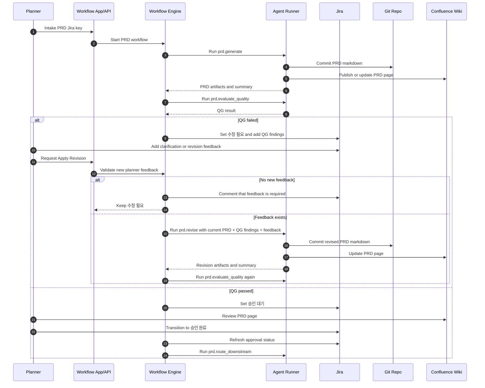

# AI Workflow System Development Plan

> **For agentic workers:** REQUIRED SUB-SKILL: Use `superpowers:subagent-driven-development` (recommended) or `superpowers:executing-plans` to implement this plan task-by-task. Steps use checkbox (`- [ ]`) syntax for tracking.

**Goal:** PRD confirmation vertical slice를 참고 구현으로 삼아, PRD/HLD/LLD/ADR/Spec/Dev/Test/Review까지 확장 가능한 실제 AI workflow 시스템을 단계적으로 구현한다.

**Architecture:** 기존 PRD 전용 in-memory slice를 바로 확장하지 않고, workflow metadata, persistent workflow state, generic document pipeline, runner abstraction, artifact store, publisher, approval gate를 별도 경계로 재구성한다. Jira는 v1 승인과 업무 추적의 source of truth로 두고, Git repo는 markdown 원본, Confluence는 review/publish surface로 사용한다.

**Tech Stack:** TypeScript, Node.js HTTP API, Vitest, MySQL 또는 MySQL 호환 persistent store, Jira REST, GitHub REST, Confluence REST, Claude CLI, Codex CLI.

---

## 1. 현재 상태 요약

현재 브랜치의 구현은 PRD confirmation vertical slice로 동작한다.

- `src/prd-confirmation/*`: PRD intake, job 생성, scheduler, runner worker, engine transition, in-memory store를 포함한다.
- `src/workflow-api/server.ts`: `/prd/intake`, `/prd/feedback-revision`, `/state/:prdJiraKey`와 수동 개발/테스트용 `/tick` API를 제공한다.
- `src/runner-engines/*`: Claude CLI/Codex CLI를 실행하고 JSON 결과를 파싱하는 runner engine 초안을 제공한다.
- `scripts/prd-cli-engine.mjs`: PRD 생성/평가/수정 prompt bridge 역할을 한다.
- `src/integrations/confluence-wiki.ts`: PRD 전용 메서드를 유지하면서도 generic `publishMarkdownPage()`를 제공한다.
- `tests/*`: PRD workflow, API, real adapter, CLI runner, Confluence upsert 동작을 검증한다.

검증된 사실은 다음과 같다.

- PRD confirmation vertical slice는 runtime에서 내부 tick loop로 자동 진행되며, `/tick`은 개발/테스트용 수동 trigger로 남아 있다.
- Claude CLI/Codex CLI를 통해 실제 markdown 문서를 생성할 수 있다.
- 생성 markdown을 Git repo에 저장하고 Confluence wiki에 publish/update할 수 있다.
- document/result의 한국어 출력은 CLI prompt contract로 제어 가능하다.
- artifact는 current view와 history를 분리해야 API 응답 중복과 크기 증가를 피할 수 있다.

## 2. 제품화 원칙

- PRD 전용 구현을 직접 키우지 않고, 전체 workflow runtime의 참고 구현으로 사용한다.
- 문서 타입은 `prd`, `hld`, `lld`, `adr`, `spec`을 같은 모델 위에서 다룬다.
- workflow definition과 workflow run state를 분리한다.
- runner는 workflow engine을 직접 변경하지 않고 structured JSON result만 반환한다.
- markdown 원본은 Git repo artifact로 추적하고, wiki page는 publish artifact로 추적한다.
- UI primary node는 raw job이 아니라 task 기준으로 둔다. PRD/HLD/LLD/Spec/Code task는 generate/evaluate/revise/implementation 같은 하위 job history를 소유하고, task 상태는 하위 job과 gate 결과를 roll-up해서 표시한다. Raw job은 scheduler/runner 실행 record로 유지한다. `WorkflowTask`는 도메인/DB/API read model로 승격되었고, `workflow_run -> workflow_task -> workflow_job` 구조를 기본으로 사용한다.
- 문서 생성/수정 job은 markdown 생성, Git 저장, Wiki publish를 하나의 묶음 job으로 처리한다. publish 실패는 같은 job 재시도로 해결하고, 별도 workflow node로 쪼개지 않는다.
- quality evaluation은 생성/수정 job에 묶지 않고 별도 gate job으로 둔다. 평가 결과가 승인 대기, 수정 요청, downstream 진행을 결정하기 때문이다.
- PRD/HLD/LLD/Spec 문서는 같은 generate -> quality evaluation -> feedback revision -> approval 패턴을 사용한다. 차이는 입력 context, approval owner, downstream fan-out 규칙이다.
- API current view는 최신 artifact/result만 반환하고, history는 별도 endpoint에서 page 단위로 조회한다.
- 품질 실패는 기본적으로 자동 rewrite가 아니라 human clarification 또는 explicit revision으로 이어진다.
- Jira status transition은 v1의 최종 approval source of truth로 둔다.

## 3. 목표 아키텍처

```text
Workflow App
  -> Workflow API
  -> Workflow Definition / Metadata
  -> Workflow Engine
  -> Scheduler
  -> Agent Runner
  -> CLI Engine Adapters
  -> Artifact Store
  -> Document Publisher
  -> Quality Gate / Approval Gate
  -> Jira / GitHub / Confluence integrations
```

### 3.1 Workflow App

Workflow App은 사용자-facing control plane이다.

- workflow intake 시작
- workflow run tree 조회
- current document와 gate status 조회
- feedback revision 요청
- approval 상태 확인
- runner job 재시도/취소 요청
- 향후 workflow definition editor와 execution dashboard 제공

v1은 API-first로 구현하고, dashboard는 API가 안정된 뒤 M5에서 붙인다.

### 3.2 Workflow Definition / Metadata

Workflow Definition은 실행 로직을 코드에 하드코딩하지 않기 위한 metadata 계층이다.

초기 definition 필드:

```text
workflow_definition
  id
  name
  version
  entry_stage
  stages
  transitions
  gates
  runner_job_templates
  artifact_policies
  integration_bindings
  status
```

초기에는 DB seed 또는 TypeScript fixture로 시작한다. Workflow editor는 M5 이후로 미룬다.

### 3.3 Workflow Engine

Workflow Engine은 workflow run의 state transition만 책임진다.

- intake command 처리
- job graph 생성
- runner job 생성
- runner result 처리
- quality gate 결과 반영
- approval gate 대기/통과 처리
- feedback revision job 생성
- parent-child run fan-out/fan-in 처리

Engine은 Claude/Codex CLI, Git, Wiki API를 직접 호출하지 않는다.

### 3.4 Scheduler

Scheduler는 pending job을 claim하고 runner가 실행할 수 있는 단위로 넘긴다.
Scheduler는 중앙 Workflow App/API 쪽에 하나의 control plane으로 둔다. Local runner가 여러 PC에서 실행되더라도 job 배정, lease, retry, cancellation, stale recovery의 최종 결정은 중앙 Scheduler가 담당한다. Runner 내부의 polling loop는 Scheduler가 아니라 중앙 Scheduler에 claim을 요청하는 worker loop다.

필수 기능:

- atomic claim
- worker heartbeat
- timeout
- retry budget
- cancellation
- stale job recovery
- concurrency limit
- job priority
- runner registration
- runner capability matching
- assigned user/team/project/repository scope 검사

초기 구현은 DB polling으로 충분하다. Queue 도입은 runner throughput과 운영 요구가 확인된 뒤 결정한다.

### 3.5 Agent Runner

Agent Runner는 claimed job을 실행하고 result/event/artifact를 기록한다.
Runner deployment mode는 두 가지를 지원할 수 있게 설계한다.

- `managed`: 중앙 서버 또는 운영자가 관리하는 실행 환경에서 구동된다.
- `local`: 개발자/기획자 PC에서 직접 구동된다. 사용자의 로컬 Codex CLI, Claude CLI, repo 접근 권한, 로컬 인증을 활용한다.

책임:

- workspace preparation
- prompt input assembly
- selected engine adapter 호출
- stdout/stderr/log capture
- generated file collection
- structured JSON validation
- artifact registration
- job result 저장

Runner는 workflow state transition을 직접 수행하지 않고 `workflow_job_result`만 남긴다.
Local runner는 아무 job이나 가져가지 않는다. 중앙 Scheduler가 runner identity, owner, team/project/repository scope, assigned user/team, required capabilities, available engines를 모두 검사한 뒤 claim lease를 발급한다. 초기 MVP에서는 local runner가 `assigned_user_id`가 자기 자신인 job만 claim하도록 제한한다.

Local runner 설정 예시:

```yaml
apiUrl: https://workflow.example.com
runnerToken: local runner token
defaultEngine: codex
engines:
  - codex
  - claude
capabilities:
  - document.generate
  - document.evaluate
  - spec.implement
workspaceRoot: ~/ai-workflow-runner
concurrency: 1
```

### 3.6 CLI Engine Adapters

CLI Engine Adapter는 Claude CLI/Codex CLI 차이를 감춘다.

공통 interface:

```text
runJson(input, options) -> structured JSON object
```

필수 제어:

- command/path/model/max-turns/timeout 설정
- stdin prompt contract
- JSON object parsing
- non-zero exit error normalization
- timeout kill
- cancellation signal
- retry 가능 오류와 불가능 오류 구분
- engine별 sandbox/workdir 옵션

### 3.7 Artifact Store

Artifact Store는 문서와 실행 산출물의 current pointer와 immutable history를 분리한다.

- current artifact: 화면/API에서 기본 노출되는 최신 artifact
- artifact history: 생성/수정/평가/publish 시점별 immutable record
- version: document version, git commit, wiki page version, job result version을 연결
- dedupe: 같은 content hash와 같은 target location이면 history 중복 기록을 제한
- Git 저장과 Wiki publish는 생성/수정 job의 side effect로 기록한다. 일반적인 성공 경로에서는 별도 publish job을 만들지 않는다.

### 3.8 Document Publisher

Document Publisher는 PRD 전용이 아니라 generic markdown page publisher다.

지원 대상:

- Confluence page create/update
- document type별 parent page routing
- page title strategy
- markdown to Confluence storage conversion
- existing page lookup/upsert
- wiki version capture

Publisher는 markdown 원본을 canonical source로 보지 않는다. canonical source는 Git markdown artifact다.

### 3.9 Quality Gate / Approval Gate

Quality Gate는 AI 평가와 deterministic validation을 함께 포함한다.

- AI rubric evaluation
- required section validation
- structured JSON schema validation
- score threshold
- missing information
- clarification questions
- risk items
- rewrite recommendation

Approval Gate는 human decision boundary다.

- v1 final approval source: Jira status transition
- Workflow App action은 Jira transition을 보조하거나 Jira 상태를 refresh한다.
- gate 통과 전 downstream stage는 시작하지 않는다.

### 3.10 Jira/GitHub/Confluence Integration

Jira:

- intake source of truth
- approval source of truth
- workflow run id, artifact URL, quality score, gate status writeback
- feedback comment 수집
- issue hierarchy PRD Initiative -> HLD Epic -> LLD Story -> Spec/Dev Task

GitHub:

- code implementation branch/PR 생성
- generated spec과 implementation trace 연결
- review/test status 수집
- markdown document repo가 GitHub remote를 가질 경우 commit URL 기록

Confluence:

- document review/publish surface
- page URL/version 기록
- feedback 수집은 v1에서 explicit trigger 기반

## 4. 전체 Workflow 단계

표준 stage 흐름:

```text
intake
-> PRD generate/evaluate/approve
-> HLD generate/evaluate/approve
-> LLD generate/evaluate/approve
-> ADR generate/review
-> Spec generate/verify
-> Dev implementation
-> Test/review
-> feedback/revision loop
```

### 4.1 Intake

- 기존 Jira ticket 또는 PRD container ticket을 입력으로 받는다.
- linked source request snapshot을 저장한다.
- target repository, owner, approver, workflow definition을 결정한다.
- active run 중복을 검사한다.

### 4.2 PRD 생성/평가/승인

- linked source requests를 기반으로 PRD markdown 생성
- product-level Acceptance Criteria를 PRD에 포함한다.
- 같은 generate/revise job 안에서 Git markdown artifact 저장과 Confluence wiki page publish/update 수행
- 별도 quality evaluation job 실행
- 실패 시 `needs_revision`
- 명시적 feedback revision 요청 후 재평가
- 기획자가 PRD와 Acceptance Criteria를 Jira transition으로 승인한다.
- Jira approved status 확인 후 downstream routing 실행

PRD downstream routing 확정 기준:

```text
domain_impact_count >= 2
  -> HLD부터 시작

domain_impact_count == 1 and usecase_count >= 2
  -> LLD부터 시작

domain_impact_count == 1 and usecase_count == 1
and single API/entrypoint-centered change
  -> Spec부터 시작

unable to determine confidently
  -> 규모 확인 필요
```

Escalation rule:

- 단일 use case라도 DB schema, data migration, backward compatibility, shared contract 변경이 있으면 LLD부터 시작한다.
- cross-domain policy, domain model, shared platform behavior 변경이 있으면 HLD부터 시작한다.
- technology 또는 architecture decision이 선행되어야 하면 routing result에 `adr_needed: true`를 포함한다.
- `adr_needed: true`는 HLD/LLD 생성 전에 무조건 ADR을 먼저 만들라는 뜻이 아니다. HLD/LLD 생성 job에서 ADR 후보를 함께 도출하고, 확정이 필요한 항목만 별도 ADR job으로 분리한다.
- `규모 확인 필요` 상태에서는 개발자가 HLD/LLD/Spec 시작점을 직접 선택하거나 추가 설명을 제공한다. 직접 선택이 있으면 그 선택을 우선하고, 추가 설명만 있으면 `prd.route_downstream`을 다시 실행한다.

Routing count 기준:

- domain impact는 해당 domain의 model, policy, state, ownership boundary, transaction behavior, event/API contract가 바뀔 때만 count한다.
- 다른 domain 데이터를 read-only lookup 또는 display만 하는 경우는 dependency로 기록하되, 그 자체로 HLD를 강제하지 않는다.
- use case는 독립적인 user action, API, scheduled job, message consumer/producer, state-changing command, 독립적으로 검증 가능한 Acceptance Criteria를 기준으로 count한다.
- target repository가 여러 개여도 domain model이나 policy 변경이 한 domain에 제한되면 자동으로 HLD로 올리지 않는다.
- 여러 repository 변경이 service boundary, shared contract, state propagation을 바꾸면 HLD로 올린다.

Routing result schema:

```yaml
route: HLD | LLD | Spec | NeedsScaleClarification
confidence: high | medium | low
usecase_count: 1
domain_impact_count: 1
domains:
  - Order
reasons:
  - Single Order API use case can be specified directly.
dependencies:
  - Payment is read-only dependency, not an impacted domain.
adr_needed: false
needs_clarification:
  - Confirm whether Payment status is updated or only read.
next_work_items:
  - type: Spec
    suggested_jira_parent: PRD-123
    source_prd_url: https://example.invalid/prd/PRD-123
```

Routing 결과 처리:

- high/medium confidence는 route에 따라 HLD/LLD/Spec 다음 job을 생성한다.
- low confidence 또는 `NeedsScaleClarification`은 Jira 상태를 `규모 확인 필요`로 전환한다.
- Per-PRD routing result는 PRD Jira ticket의 structured comment/field와 workflow job result에 저장한다.
- HLD/LLD/Spec Jira ticket은 routing 확정 후에만 생성한다.
- routing runner 실행 자체마다 별도 Jira issue를 만들지 않는다.

### 4.3 HLD 생성/평가/승인

- approved PRD와 target repository context를 입력으로 받는다.
- domain boundary, architecture decision, affected systems를 기술한다.
- 여러 LLD로 fan-out할 기준을 포함한다.
- PRD와 동일하게 generate, quality evaluation, feedback revision, approval 패턴을 따른다.
- quality gate 통과 후 개발자 approval을 기다린다.

### 4.4 LLD 생성/평가/승인

- HLD 또는 PRD direct route에서 생성된다.
- use case, API, data model, migration, failure mode, test strategy를 포함한다.
- 여러 Spec으로 fan-out할 기준을 포함한다.
- PRD와 동일하게 generate, quality evaluation, feedback revision, approval 패턴을 따른다.
- quality gate 통과 후 개발자 approval을 기다린다.

### 4.5 ADR 생성/검토

- architecture decision이 필요한 경우 HLD/LLD 단계에서 파생된다.
- ADR은 approval보다 review 중심으로 시작한다.
- accepted/superseded/deprecated 상태를 관리한다.
- 관련 HLD/LLD/Spec과 trace link를 유지한다.

### 4.6 Spec 생성/검증

- 구현 가능한 단위로 쪼갠다.
- repository path, target modules, API contract, acceptance test, non-goal을 포함한다.
- Spec은 implementation-level Acceptance Criteria와 Test Case draft를 포함한다. TC draft는 Spec 생성 job이 자동 생성하고, 개발자가 Spec 승인 전에 수정/보강할 수 있다.
- code generation 전 deterministic validation과 AI validation을 모두 통과해야 한다.
- PRD와 동일하게 generate, quality evaluation, feedback revision, approval 패턴을 따른다. 다만 Spec approval 이후 downstream은 문서 생성이 아니라 Dev implementation이다.

### 4.7 Dev Implementation

- Spec 단위로 branch/worktree를 준비한다.
- Claude/Codex runner 또는 사람 개발자가 구현한다. Runner는 중앙 managed runner 또는 개발자 PC의 local runner일 수 있다.
- Local runner는 담당자에게 배정된 job, 허용된 project/repository, 필요한 capability와 engine이 모두 맞는 경우에만 claim한다.
- generated code, tests, logs, PR link를 artifact로 기록한다.

### 4.8 Test/Review

- unit/integration/e2e/lint/typecheck 결과를 수집한다.
- GitHub PR review 상태와 CI 상태를 수집한다.
- Dev 완료 후 QA가 Test Case를 finalize하고 검증 결과를 승인한다.
- QA finalized TC와 검증 결과는 Spec revision이 아니라 별도 QA artifact로 저장한다. v1은 Wiki 요약과 DB/API 상세로 시작하고, 이후 QA가 익숙한 Excel export를 추가한다.
- 실패 시 implementation revision 또는 Spec clarification으로 되돌린다.

### 4.9 Feedback/Revision Loop

- Jira comment, Workflow App feedback, Confluence feedback을 explicit revision input으로 수집한다.
- revision job은 현재 document version을 기준으로 patch/rewrite를 수행한다.
- revision 후 품질 평가를 다시 실행한다.

## 5. 문서 타입 모델

### 5.1 Document Type

초기 document type:

```text
prd
hld
lld
adr
spec
```

공통 필드:

```text
document
  id
  workflow_run_id
  parent_document_id
  type
  source_key
  title
  status
  current_version_id
  current_markdown_artifact_id
  current_wiki_artifact_id
  created_at
  updated_at
```

type별 차이는 metadata로 확장한다.

```text
document_metadata
  document_id
  key
  value_json
```

예시:

- PRD: source request keys, business owner, downstream route
- HLD: affected domains, developer owner
- LLD: use case group, target repository
- ADR: decision status, alternatives
- Spec: implementation scope, test command, target paths

### 5.2 Current Document vs History

- `document.current_version_id`: 최신 승인 또는 최신 생성본을 가리키는 pointer
- `document_version`: immutable version history
- `document_revision`: feedback/revision request와 적용 결과를 연결

`current`는 빠른 조회용이고 `history`는 감사/비교/재현용이다.

### 5.3 Markdown Artifact vs Wiki Page Artifact

Markdown artifact:

- canonical document source
- Git repo path/commit/content hash 기록
- document version과 1:1 또는 N:1로 연결

Wiki page artifact:

- review/publish copy
- Confluence page id/url/version 기록
- markdown version에서 파생됨

### 5.4 Versioning/Timestamp Strategy

문서 version은 다음 규칙을 따른다.

- version number는 document별 monotonic integer다.
- timestamp는 DB `created_at`을 기준으로 한다.
- Git commit hash가 있으면 markdown artifact에 저장한다.
- wiki version number가 있으면 wiki artifact에 저장한다.
- 동일 content hash를 같은 document에 다시 publish하면 새 document version은 만들지 않고 publish event만 갱신한다.

## 6. Artifact 전략

### 6.1 Current Artifacts

State/current API는 기본적으로 최신 artifact만 반환한다.

```json
{
  "currentArtifacts": {
    "markdown": {
      "artifactId": "art_123",
      "url": "https://github.example/doc.md",
      "version": 3
    },
    "wiki": {
      "artifactId": "art_124",
      "url": "https://wiki.example/page",
      "version": 7
    }
  }
}
```

### 6.2 Artifact History

History API는 pagination을 요구한다.

```text
GET /artifacts?documentId=doc_123&type=markdown&limit=50&cursor=...
```

응답은 생성 job, content hash, external URL, created_at, superseded 여부를 포함한다.

### 6.3 Versioning

artifact는 immutable record이고 document가 current pointer를 가진다.

```text
artifact
  id
  document_id
  document_version_id
  producer_job_id
  type
  location
  uri
  external_id
  external_version
  content_hash
  metadata_json
  created_at
```

### 6.4 Dedupe Policy

- 같은 `document_id + type + location + content_hash`는 중복 artifact로 저장하지 않는다.
- 같은 content를 다시 publish했지만 wiki external version이 증가하면 publish event를 별도 기록한다.
- API current view는 `document.current_*_artifact_id`만 읽는다.
- history view는 artifact와 publish event를 함께 조회한다.

### 6.5 API Response Design

- `/workflow-runs/:id`는 run tree와 current status 중심이다.
- `/documents/:id/current`는 current document, current artifacts, latest gate result만 반환한다.
- `/documents/:id/versions`는 version history를 pagination으로 반환한다.
- `/artifacts`는 artifact history를 filtering/pagination으로 반환한다.
- runner stdout/stderr는 기본 state API에 포함하지 않고 job log endpoint에서 조회한다.

## 7. Approval/Revision 전략

### 7.1 Jira Source of Truth

v1에서는 Jira status transition을 final approval source of truth로 둔다. Jira workflow 상태명은 운영 표준에 맞춰 한글로 관리한다.

Workflow 관점의 역할은 `운영자`, `기획자`, `개발자`, `QA` 네 가지로 제한한다. Tech Lead, Architect, Domain owner 같은 조직 세부 역할은 workflow role로 모델링하지 않고 각 담당자가 오프라인으로 처리한다.

- PRD approval: 기획자 Jira transition
- HLD approval: 개발자 Jira transition
- LLD approval: 개발자 Jira transition
- Spec approval: 개발자 Jira transition

Workflow App의 approve action은 내부 승인만 남기지 않고 Jira transition을 호출하거나, Jira 상태를 refresh해서 승인 여부를 반영한다.

문서 공통 approval/revision 패턴:

- PRD/HLD/LLD/Spec 모두 generate -> quality evaluation -> feedback revision -> approval 흐름을 따른다.
- QG 실패만으로 자동 rewrite를 만들지 않는다.
- QG 실패 결과는 Jira comment 또는 Workflow App에 missing information, clarification questions, risk items로 기록한다.
- 담당자가 feedback을 제공하고 명시적으로 revision을 요청해야 revise job을 실행한다.
- 새 feedback 없이 revision을 요청하면 runner를 실행하지 않고 Jira comment로 feedback 필요를 알린다.
- QG 통과 후 approval owner가 Jira transition으로 승인한다.
- 승인 후 다음 단계 job은 workflow definition에 따라 자동 생성된다.
- Jira 상태 표시명은 문서 타입별 prefix를 붙여 운영자가 구분하기 쉽게 한다. 예: `PRD 요청`, `HLD 요청`, `LLD 요청`, `Spec 요청`.
- 내부 workflow semantics는 공통 상태로 매핑한다. 예: requested, drafting, evaluating_quality, needs_revision, revising, approval_ready, approved, paused, canceled.

AC/TC ownership:

- PRD는 product-level Acceptance Criteria를 반드시 포함한다.
- PRD의 Acceptance Criteria는 기획자가 PRD 승인과 함께 승인한다.
- QA는 PRD AC를 approval하지 않는다.
- Spec은 implementation-level Acceptance Criteria와 Test Case draft를 포함한다.
- Test Case draft는 Spec 생성 job이 자동 생성한다.
- 개발자는 Spec 승인 전에 TC draft를 수정하거나 보강할 수 있다.
- Spec approval은 개발자가 수행한다.
- Dev 완료 후 QA가 Test Case를 finalize하고 QA 검증 결과를 승인한다.
- QA가 finalize한 Test Case는 Spec 문서를 revision하지 않고 별도 QA artifact로 기록한다. v1은 Wiki summary와 DB/API detail을 사용하고, 이후 Excel export를 제공한다.

PRD Jira 상태 기본안:

```text
PRD 요청
초안 작성 중
품질 평가 중
수정 필요
수정 중
승인 대기
승인 완료
하위 단계 라우팅 중
규모 확인 필요
하위 단계 시작됨
보류
취소됨
```

상태 의미:

- `PRD 요청`: PRD ticket의 최초 상태다. 기획자가 PRD ticket을 만들었고 workflow intake를 기다린다.
- `초안 작성 중`: `prd.generate` job이 실행 중이다.
- `품질 평가 중`: `prd.evaluate_quality` job이 실행 중이다.
- `수정 필요`: QG 실패 또는 revision feedback이 필요하다.
- `수정 중`: `prd.revise` job이 실행 중이다.
- `승인 대기`: QG 통과 후 기획자/PO 승인을 기다린다.
- `승인 완료`: 기획자가 Jira에서 명시적으로 승인했다. Workflow는 이 상태를 감지하면 자동으로 downstream routing을 시작한다.
- `하위 단계 라우팅 중`: `prd.route_downstream` job이 실행 중이다.
- `규모 확인 필요`: PRD는 승인됐지만 HLD/LLD/Spec 중 어디서 시작할지 자동 판단하기에 정보가 부족하다. PRD 승인 이후 단계이므로 개발자가 변경 규모와 영향 범위를 확인해야 한다.
- `하위 단계 시작됨`: HLD/LLD/Spec 다음 단계 job 생성이 완료됐다.
- downstream routing 확신도가 낮으면 HLD/LLD/Spec을 자동 생성하지 않고 clarification을 요청한다.
- `규모 확인 필요` 상태에서 개발자가 HLD/LLD/Spec 시작점을 직접 선택하면 그 선택을 우선한다. 직접 선택 없이 추가 설명만 제공하면 해당 feedback을 포함해 `prd.route_downstream`을 다시 실행한다.
- `보류`: PRD workflow를 일시 정지한다. 같은 PRD workflow를 나중에 재개할 수 있으며, 연결된 source request는 아직 이 PRD에 묶여 있으므로 새 PRD에서 재사용할 수 없다.
- `취소됨`: PRD workflow를 더 이상 진행하지 않는 terminal 상태다. 연결된 source request는 새 PRD에서 다시 사용할 수 있다.

PRD intake 규칙:

- Workflow intake는 Jira 상태가 `PRD 요청`인 PRD ticket만 허용한다.
- 이미 진행 중이거나 완료된 PRD ticket은 일반 intake로 다시 시작하지 않는다.
- 재개, 재시도, 복구는 별도 `resume` 또는 `retry` action으로 분리한다.
- source request는 동시에 둘 이상의 active PRD workflow에 포함될 수 없다.
- `보류` 상태의 PRD workflow는 active로 간주하므로 연결된 source request를 새 PRD에서 재사용할 수 없다.
- 기존 PRD workflow가 `취소됨` 또는 완료 상태가 된 뒤에는 같은 source request를 새 PRD에 다시 연결할 수 있다. 예를 들어 진행 중 추가 요청이 생겨 기존 workflow를 취소하고 구요청과 신요청을 새 PRD로 다시 묶을 수 있다.

보류 처리 규칙:

- `보류`는 hard cancel이 아니다.
- 이미 실행 중인 job은 강제로 중단하지 않고 완료까지 둔다.
- 완료된 job result와 artifact는 기록한다.
- workflow engine은 `보류` 상태에서 다음 job을 생성하거나 pending job을 claim하지 않는다.
- `보류` 해제 후 workflow는 마지막 기록된 상태와 job result를 기준으로 재개한다.

취소 처리 규칙:

- `취소됨`은 terminal cancel 상태다.
- pending job은 취소 처리하고 더 이상 claim하지 않는다.
- running job에는 cancel request를 전달한다.
- 이미 완료된 Git/Wiki 같은 external side effect는 되돌리지 않고 artifact/event로 기록한다.
- workflow engine은 `취소됨` 상태에서 후속 job을 생성하지 않는다.
- 취소 전에 생성된 Git markdown은 이력으로 유지한다.
- 취소 전에 생성된 Wiki page는 삭제하지 않고 제목 또는 상단 상태 표시에 `[취소됨]`을 남긴다.

### 7.2 Wiki Feedback과 Jira Feedback 수집

v1 feedback 수집 방식:

- Workflow App revision request
- Jira comment command
- Confluence feedback은 사용자가 명시적으로 "feedback ready"를 눌러 수집

자동 wiki polling/webhook은 v1 범위에서 제외한다. Confluence comment API 안정성과 권한 모델을 확인한 뒤 production integration 단계에서 추가한다.

### 7.3 Quality Gate 실패 처리

품질 실패 시 기본 동작:

- 자동 rewrite를 즉시 수행하지 않는다.
- missing information, clarification questions, risk items를 저장한다.
- Jira 상태를 `수정 필요`로 전환하거나 comment를 남긴다.
- 사용자가 clarification 또는 feedback을 제공한 뒤 명시적으로 revision을 요청하면 revision job을 생성한다.
- revision 요청 시 새 planner feedback이 없으면 runner를 실행하지 않는다. Jira comment로 피드백이 필요하다고 알리고 상태는 `수정 필요`로 유지한다.

PRD QG/revision/approval 시퀀스:



자동 rewrite가 허용되는 경우:

- 입력 부족이 아니라 형식/구조 문제임이 gate result에서 명확한 경우
- retry budget이 남아 있는 경우
- workflow definition에서 `auto_rewrite_on_format_failure=true`로 설정한 경우

## 8. Runner 전략

### 8.1 Claude CLI / Codex CLI Abstraction

현재 `src/runner-engines/cli-engine.ts`와 `scripts/prd-cli-engine.mjs`는 유지하되, PRD 전용 bridge를 generic document runner bridge로 확장한다.

목표 interface:

```text
CliEngineAdapter
  runJson({ jobType, prompt, workspace, schema, timeout, cancellationToken })
```

engine별 차이:

- Claude CLI: prompt mode, max turns, output format
- Codex CLI: exec mode, sandbox, output-last-message, workspace policy

### 8.2 Prompt Contract

runner prompt는 job type별로 versioned contract를 가진다.

```text
prompt_contract
  id
  job_type
  document_type
  version
  input_schema
  output_schema
  language_policy
  prompt_template
```

모든 human-readable output은 `outputLanguage`를 따른다. 한국어 기본값은 `ko`다.

### 8.2.1 Runner Deployment and Claim Policy

Workflow App은 중앙 Scheduler와 runner registry를 가진다. Runner는 managed runner와 local runner를 모두 지원한다.

```text
runner
  id
  owner_user_id
  mode: managed | local
  status: online | offline | busy | disabled
  team_ids
  allowed_project_ids
  allowed_repository_ids
  capabilities
  engines
  default_engine
  last_heartbeat_at
```

```text
workflow_job
  assigned_user_id
  assigned_team_id
  project_id
  repository_id
  required_role
  required_capabilities
  preferred_engine
  required_engine
  execution_policy: managed_only | local_allowed | local_required | assigned_runner_only
  assigned_runner_id
  claimed_by_runner_id
  lease_expires_at
```

Local runner claim MVP 정책:

- runner는 중앙 Workflow App에 인증된 runner token으로 등록한다.
- runner heartbeat에는 mode, owner, capabilities, engines, concurrency를 포함한다.
- local runner는 기본적으로 `assigned_user_id = runner.owner_user_id`인 job만 claim한다.
- `assigned_team_id` 기반 claim은 팀 단위 운영이 필요해진 뒤 확장한다.
- job의 project/repository scope가 runner 허용 범위에 포함되어야 한다.
- job의 `required_capabilities`가 runner capabilities의 subset이어야 한다.
- job의 `required_engine` 또는 `preferred_engine`은 runner engines와 호환되어야 한다.
- `managed_only` job은 local runner가 claim할 수 없다.
- `assigned_runner_only` job은 지정 runner만 claim할 수 있다.

초기 claim 조건:

```text
job.status = pending
AND job.execution_policy != managed_only
AND job.assigned_user_id = runner.owner_user_id
AND job.project_id IN runner.allowed_project_ids
AND job.repository_id IN runner.allowed_repository_ids
AND job.required_capabilities SUBSET_OF runner.capabilities
AND (job.required_engine IS NULL OR job.required_engine IN runner.engines)
AND job.lease_expires_at IS NULL OR job.lease_expires_at < now
```

중앙 Scheduler는 claim lease를 발급하고, local runner는 lease 기간 안에 heartbeat와 result/log/artifact upload를 수행한다. Runner PC가 꺼지거나 네트워크가 끊기면 lease 만료 후 stale recovery가 job을 다시 pending 또는 retrying으로 돌린다.

### 8.3 Structured JSON Output Contract

문서 생성 job:

```json
{
  "status": "succeeded",
  "markdown": "# ...",
  "summary": "...",
  "documentMetadata": {}
}
```

품질 평가 job:

```json
{
  "status": "passed",
  "score": 90,
  "summary": "...",
  "missingInformation": [],
  "clarificationQuestions": [],
  "riskItems": []
}
```

revision job:

```json
{
  "status": "succeeded",
  "markdown": "# ...",
  "summary": "...",
  "revisionSummary": "...",
  "appliedFeedbackIds": []
}
```

implementation job:

```json
{
  "status": "succeeded",
  "summary": "...",
  "changedFiles": [],
  "testCommands": [],
  "pullRequestUrl": null
}
```

### 8.4 Timeout/Retry/Cancellation

- job timeout은 workflow definition의 job template에 둔다.
- engine별 command/model/sandbox/workdir도 job template의 runner 설정에 둔다. Local runner는 claim 후 job template을 해석해 자신의 로컬 Codex/Claude command와 결합한다.
- template의 `workdir`는 준비된 runner workspace 안에서만 해석한다. 상대 경로는 job workspace 기준이고, workspace 밖 경로는 거부한다.
- runner process timeout과 engine timeout을 분리한다.
- cancellation은 DB job status를 `cancel_requested`로 바꾸고 runner가 주기적으로 확인한다.
- retry는 idempotent job만 자동 허용한다.
- Git 저장/Wiki publish 같은 external side effect는 문서 생성/수정 job 안에서 수행하되 idempotency key를 가진다.
- publish만 일시 실패해도 workflow node를 늘리지 않고 같은 job을 재시도한다.

Job template runner 설정 예시:

```json
{
  "runnerJobTemplate": {
    "runner": {
      "engine": "codex",
      "command": "codex",
      "model": "gpt-5.3-codex",
      "timeoutMs": 180000,
      "sandbox": "workspace-write",
      "workdir": "implementation"
    }
  }
}
```

### 8.5 Workspace Preparation

runner workspace는 job마다 격리한다.

- document generation: read-only source snapshots + output directory
- spec/dev implementation: git worktree 또는 temp clone
- generated files: declared output directory에서 수집
- secrets: environment allowlist 기반 주입
- cleanup: 성공/실패 후 retention policy에 따라 보존 또는 삭제

### 8.6 Generated File Collection

runner는 결과 JSON만 믿지 않고 파일 시스템 산출물을 수집한다.

- declared output manifest
- changed file list
- content hash
- size limit
- forbidden path 검사
- artifact store 등록

## 9. 데이터 저장 전략

현재 in-memory store는 M1에서 persistent store로 전환한다. 초기 production target은 MySQL 또는 MySQL 호환 DB다.

초안 엔티티:

```text
workflow_definition
workflow_stage_definition
workflow_transition_definition
workflow_run
workflow_event
workflow_job
workflow_job_document_link
workflow_job_result
workflow_job_log
document
document_version
document_metadata
artifact
artifact_publish_event
quality_gate_result
approval_gate
feedback_item
external_issue_snapshot
external_link
integration_account
runner
runner_heartbeat
runner_workspace
```

핵심 관계:

- `workflow_run` 1:N `workflow_job`
- `workflow_job` 1:1 또는 1:N `workflow_job_result`
- `workflow_job.primary_document_id`는 UI와 current lookup을 위한 주 문서 pointer다.
- `workflow_job_document_link`는 job이 읽거나 생성하거나 수정한 document를 N:M으로 연결한다.
- `workflow_job_document_link.role` 초기값은 `primary`, `reads`, `creates`, `updates`, `evaluates`로 둔다.
- `document` 1:N `document_version`
- `document_version` 1:N `artifact`
- `quality_gate_result`는 `document_version`과 `workflow_job`에 연결
- `feedback_item`은 Jira comment, Wiki comment, App input을 공통 모델로 저장
- `external_link`는 Jira/GitHub/Confluence URL과 내부 entity를 연결
- `runner`는 managed/local runner의 owner, scope, capabilities, engines, status를 저장
- `workflow_job.claimed_by_runner_id`와 `lease_expires_at`은 중앙 Scheduler의 claim lease를 표현

`workflow_job.status` 초기값:

```text
pending
claimed
running
succeeded
failed
cancel_requested
canceled
skipped
retrying
```

Timeout, schema validation failure, runner output parse failure 같은 상세 실패 원인은 status로 세분화하지 않고 `workflow_job_result.error_code`, `workflow_job_result.error_message`, `workflow_event`에 기록한다.

DB 전환 순서:

1. Repository interface를 먼저 만들고 in-memory 구현으로 테스트를 보존한다.
2. MySQL schema와 migration을 추가한다.
3. transactional claim과 result processing을 DB transaction으로 옮긴다.
4. runtime fixture를 in-memory와 MySQL mode로 분리한다.

M1에서는 repository interface와 in-memory adapter로 workflow/document/job 모델을 먼저 안정화한 뒤, 같은 milestone 후반에 MySQL schema와 transaction 구현으로 전환한다.

## 10. API 설계

### 10.1 Workflow Intake

```text
POST /workflow-runs
```

요청:

```json
{
  "workflowDefinitionId": "prd_to_spec",
  "source": {
    "type": "jira",
    "primaryKey": "PAIR-2"
  },
  "options": {
    "outputLanguage": "ko"
  }
}
```

응답:

```json
{
  "workflowRunId": "run_123",
  "status": "accepted"
}
```

### 10.2 Worker Execution and Background Scheduler

개발/테스트:

```text
POST /tick
```

운영:

```text
Internal workflow tick loop
Scheduler process
Runner worker process
```

현재 compatibility fixture runtime은 API process 내부 tick loop가 scheduler,
runner worker, engine step을 반복 호출한다. `POST /tick`은 수동 점검과
테스트 harness용으로만 사용한다. fixture 제거 후에는 repository-backed
transition engine이 같은 역할을 별도 worker/scheduler 경계로 넘겨받는다.

### 10.2.1 Runner Registration and Claim

Local runner와 managed runner는 같은 API contract로 중앙 Scheduler에 연결한다.

```text
POST /runners/register
POST /runners/:runnerId/heartbeat
POST /runners/:runnerId/claim
POST /runner-jobs/:jobId/results
POST /runner-jobs/:jobId/logs
POST /runner-jobs/:jobId/artifacts
```

`/claim`은 runner가 직접 job을 고르는 API가 아니다. Runner는 자신의 capabilities와 engines를 보고하고, 중앙 Scheduler가 eligible job을 선택해 claim lease를 발급한다.

초기 local runner UX:

```bash
ai-workflow-runner login
ai-workflow-runner start --engine codex
ai-workflow-runner start --engine claude
```

### 10.3 State/Current View

```text
GET /workflow-runs/:runId
GET /workflow-runs/:runId/tree
GET /documents/:documentId/current
GET /runner-jobs/:jobId/logs?limit=50&cursor=...
GET /approval-gates/:gateId
```

current view는 최신 상태, 최신 artifact, 최신 gate result, approval gate, 아직 revision에 사용되지 않은 pending feedback만 반환한다.

### 10.4 Artifact History

```text
GET /documents/:documentId/versions
GET /artifacts?documentId=...&type=...&limit=...
GET /runner-jobs/:jobId/logs?limit=...&cursor=...
```

history/log endpoint는 pagination을 필수로 한다. Runner log API는 opaque `nextCursor`를 반환하고, 다음 페이지는 같은 cursor를 query로 넘겨 조회한다.

### 10.5 Feedback Revision

```text
POST /documents/:documentId/feedback
POST /documents/:documentId/revisions
```

feedback 저장과 revision 실행을 분리한다. 사용자가 revision 실행을 명시해야 runner job이 생성된다. 저장된 feedback은 `feedback_item`으로 보존하고, revision job input에는 적용한 feedback id 목록을 남긴다.

### 10.6 Approval Handling

```text
GET /approval-gates/:gateId
POST /approval-gates/:gateId/refresh
POST /approval-gates/:gateId/approve
POST /approval-gates/:gateId/reject
```

v1에서 approve/reject는 Jira transition 또는 Jira 상태 refresh와 연결한다. Local fixture에서는 Jira transition 대신 외부 Jira status snapshot을 갱신하고, refresh가 내부 document/workflow 상태를 다시 동기화한다.

## 11. Workflow 단계별 결정 Agenda

이 섹션은 구현 전에 함께 확정해야 할 의사결정 목록이다. Milestone은 이 결정들을 한 번에 모두 닫는 방식이 아니라, 각 milestone 착수 전에 필요한 결정만 닫는 방식으로 진행한다.

### 11.1 Intake

현재 기본안:

- v1 intake는 사용자가 기존 Jira key를 입력하는 manual command로 시작한다.
- Workflow App은 PRD/Jira ticket을 생성하지 않고, Jira에 이미 존재하는 ticket과 linked source request를 읽는다.
- source request snapshot은 생성 전에 저장한다. v1 snapshot은 summary, description, status, key, issue type, links 같은 핵심 metadata만 포함하고 Jira comment는 포함하지 않는다.

결정할 사항:

| 결정 항목 | 선택지 | 기본안 | 결정 시점 |
| --- | --- | --- | --- |
| Intake source | Jira only / App form / GitHub issue / mixed | Jira only | M1 |
| PRD ticket 생성 주체 | Planner가 Jira에서 생성 / Workflow App이 생성 | Planner가 Jira에서 생성 | M1 |
| linked source request 표현 | Jira issue links / custom field / label/JQL | Jira issue links | M1 |
| intake 허용 상태 | PRD 요청만 / 일부 진행 상태 포함 / 상태 무관 | PRD 요청만 | M1 |
| active run 중복 처리 | reject / resume / create new version | reject, explicit resume만 허용 | M1 |
| source request 중복 연결 | active 중복 금지 / 항상 허용 / 항상 금지 | active/보류 중복 금지, 취소됨/완료 후 재사용 허용 | M1 |
| 보류 처리 방식 | running job 완료 후 pause / running job cancel | running job 완료 후 pause | M1 |
| 취소 처리 방식 | running job cancel / running job 완료 후 stop | running job cancel | M1 |
| 취소 문서 처리 | 유지 / 삭제 또는 archive / 취소 표시 후 유지 | Wiki에 `[취소됨]` 표시 후 유지, Git은 이력 보존 | M1 |
| snapshot 범위 | summary+description+metadata / comments 포함 / attachments 포함 | summary+description+metadata, comments 제외 | M1 |
| output language 기본값 | ko / Jira locale / user setting | ko | M1 |

아직 모호한 부분:

- 실제 Jira project의 issue link type 이름과 custom field 사용 가능 여부
- source request comment는 v1 PRD 생성 입력에서 제외한다. 필요하면 revision feedback 또는 명시 옵션으로 확장한다.
- 여러 active 또는 `보류` 상태의 PRD가 같은 source request를 동시에 참조하는 것은 금지한다. 단, 기존 PRD workflow가 `취소됨` 또는 완료 상태가 된 뒤 새 PRD가 같은 source request를 다시 참조할 수 있다.

### 11.2 PRD 생성/평가/승인

현재 기본안:

- PRD markdown은 Git repo artifact가 canonical source다.
- Confluence page는 review/publish copy다.
- quality gate 실패는 자동 rewrite가 아니라 human clarification으로 간다.
- final approval은 Jira status transition을 source of truth로 둔다.

결정할 사항:

| 결정 항목 | 선택지 | 기본안 | 결정 시점 |
| --- | --- | --- | --- |
| PRD canonical source | Git markdown / Confluence / Jira description | Git markdown | M1 |
| PRD 저장 repo | 단일 docs repo / product별 repo / Jira project별 repo | 단일 docs repo부터 시작 | M1 |
| PRD wiki title strategy | Jira key 기반 / 문서 제목 기반 / 계층 prefix | Jira key + document title | M2 |
| 문서 생성 job 범위 | 생성만 / 생성+Git 저장 / 생성+Git 저장+Wiki publish | 생성+Git 저장+Wiki publish | M1 |
| quality evaluation job 범위 | 생성 job에 포함 / 별도 gate job | 별도 gate job | M1 |
| quality pass threshold | fixed score / rubric별 threshold / approver override | fixed threshold + override 기록 | M3 |
| quality failure action | human clarification / auto rewrite / both | human clarification | M3 |
| approval source | Jira status / Workflow App approval / both | Jira status | M3 |
| PRD Jira 상태 언어 | 영어 / 한글 / 혼합 | 한글 | M1 |
| 문서별 Jira 상태명 | 공통 상태명 / 문서 prefix 상태명 / 타입별 완전 분리 | 문서 prefix 상태명 + 내부 공통 semantics | M2 |
| 승인 후 downstream 시작 | 자동 routing / 별도 start action | 승인 완료 감지 후 자동 routing | M2 |
| downstream routing 주체 | AI runner / deterministic rule / human selection | AI recommendation + deterministic guard | M2 |
| routing low confidence 처리 | LLD로 시작 / HLD로 시작 / 규모 확인 필요 | 규모 확인 필요 | M2 |
| 규모 확인 담당 | 기획자 / 개발자 / QA | 개발자 | M2 |
| 규모 확인 후 진행 | route 직접 선택 / routing 재실행 / 둘 다 허용 | 둘 다 허용, 직접 선택 우선 | M2 |

아직 모호한 부분:

- PRD 승인 상태명과 Jira transition id
- PRD 품질 rubric의 필수 section과 점수 기준
- PRD가 이미 존재할 때 overwrite, revise, fork 중 무엇을 기본으로 할지

### 11.3 HLD 생성/평가/승인

현재 기본안:

- HLD는 approved PRD 이후 domain impact가 2개 이상이거나 architecture boundary가 크면 생성한다.
- HLD는 여러 LLD로 fan-out할 수 있는 상위 설계 문서다.
- HLD approval은 개발자 Jira approval gate로 둔다.

결정할 사항:

| 결정 항목 | 선택지 | 기본안 | 결정 시점 |
| --- | --- | --- | --- |
| HLD 생성 조건 | 항상 생성 / routing 결과에 따라 생성 / human 선택 | routing 결과에 따라 생성 | M2 |
| domain boundary 기준 | repo 기준 / service 기준 / team 기준 / bounded context 기준 | service + bounded context | M2 |
| architecture context 입력 | repo scan / existing docs / Jira labels / manual metadata | PRD + target repo metadata부터 시작 | M2 |
| HLD approver | 운영자 / 기획자 / 개발자 / QA | 개발자 | M3 |
| HLD fan-out 단위 | domain / component / use case | domain + component | M2 |
| ADR 파생 조건 | 모든 주요 결정 / risk threshold 이상 / human trigger | risk threshold 이상 또는 human trigger | M2 |

아직 모호한 부분:

- target repository를 PRD 단계에서 필수로 받을지, HLD 단계에서 보강할지
- repo scan을 자동으로 수행할 범위와 비용
- HLD 문서가 Confluence hierarchy에서 PRD 하위 page가 될지, HLD 전용 parent 아래 page가 될지
- Tech Lead, Architect, Domain owner 승인은 v1 Jira workflow role로 넣지 않는다. 필요한 경우 조직의 오프라인 승인으로 처리한다.

### 11.4 LLD 생성/평가/승인

현재 기본안:

- LLD는 HLD의 child 또는 PRD direct route의 첫 설계 문서다.
- LLD는 구현 가능한 Spec 여러 개로 분해되는 상세 설계다.
- LLD approval은 개발자 approval gate로 둔다.

결정할 사항:

| 결정 항목 | 선택지 | 기본안 | 결정 시점 |
| --- | --- | --- | --- |
| LLD 생성 조건 | HLD child only / PRD에서 direct 가능 / 항상 생성 | PRD에서 direct 가능 | M2 |
| LLD 분해 기준 | use case / API endpoint / module / data flow | use case + API boundary | M2 |
| repository context | source snapshot만 / repo file index / code search 결과 | repo file index 일부 | M2 |
| LLD 필수 section | API/data/test/rollback/security 등 | API, data, failure, test, rollout | M2 |
| LLD approver | 운영자 / 기획자 / 개발자 / QA | 개발자 | M3 |
| LLD approval source | Jira status / App approval / GitHub review | Jira status | M3 |
| Spec fan-out ownership | AI proposes / human edits / deterministic split | AI proposes, human can revise | M2 |

아직 모호한 부분:

- LLD와 Spec의 경계를 어디까지 세밀하게 나눌지
- DB migration, feature flag, rollout plan을 LLD와 Spec 중 어디에 둘지
- 여러 repository에 걸친 LLD를 하나로 둘지 repo별로 나눌지

### 11.5 ADR 생성/검토

현재 기본안:

- ADR은 모든 workflow에서 필수가 아니라 HLD/LLD 중 architecture decision이 확인될 때 생성한다.
- ADR은 approval보다 review/status 관리가 중심이다.
- ADR status는 accepted/superseded/deprecated를 지원한다.

결정할 사항:

| 결정 항목 | 선택지 | 기본안 | 결정 시점 |
| --- | --- | --- | --- |
| ADR 생성 조건 | 항상 / risk 기반 / human trigger / runner recommendation | risk 기반 + human trigger | M2 |
| ADR 생성 시점 | HLD/LLD 전 선행 / HLD/LLD와 함께 후보 도출 / HLD/LLD 후 별도 생성 | HLD/LLD와 함께 후보 도출 후 필요한 항목만 별도 ADR job | M2 |
| ADR 저장 위치 | docs repo / service repo / Confluence only | docs repo markdown + wiki publish | M2 |
| ADR status source | Git markdown frontmatter / Jira field / App DB | App DB + markdown metadata | M3 |
| ADR approval 필요 여부 | 필요 / review only / decision owner accept | decision owner accept | M3 |
| ADR과 HLD/LLD 링크 | parent_document_id / external link / both | both | M2 |

아직 모호한 부분:

- ADR numbering strategy
- existing ADR이 있을 때 supersede 판단을 자동화할지 여부
- ADR이 downstream Spec 생성을 block할 수 있는 조건

### 11.6 Spec 생성/검증

현재 기본안:

- Spec은 개발 착수 가능한 최소 단위다.
- Spec은 acceptance criteria, target files/modules, test strategy, non-goals를 포함한다.
- Spec 검증 통과 전 Dev implementation은 시작하지 않는다.

결정할 사항:

| 결정 항목 | 선택지 | 기본안 | 결정 시점 |
| --- | --- | --- | --- |
| Spec 단위 | task 단위 / API 단위 / file group 단위 / PR 단위 | PR-sized task 단위 | M2 |
| Spec source | LLD only / PRD direct / Jira task | LLD 또는 PRD direct | M2 |
| Spec verification | AI rubric / deterministic checks / both | both | M2 |
| codegen readiness 기준 | score threshold / required fields / human approval | required fields + approval | M3 |
| TC draft 생성/수정 | AI 자동 생성 / 개발자 수동 작성 / AI 생성 후 개발자 보강 | AI 생성 후 개발자 보강 | M3 |
| Spec artifact 위치 | docs repo / implementation repo / both | docs repo, implementation repo link | M2 |
| Spec과 Jira task 관계 | 1:1 / 1:N / N:1 | Spec 1개 = Jira task 1개 | M2 |

아직 모호한 부분:

- Spec이 실제 코드 diff까지 포함해야 하는지, 구현 지시서 수준까지만 둘지
- Spec 승인자가 LLD 승인자와 같아야 하는지
- Spec 변경 시 상위 LLD/HLD를 invalidation할 조건

### 11.7 Dev Implementation

현재 기본안:

- Dev implementation은 M6 전까지 상세 구현하지 않고, M2-M4에서는 document pipeline과 runner 안정화를 먼저 한다.
- Dev stage는 Spec이 승인된 뒤 GitHub branch/PR과 연결된다.
- 구현 runner는 generated files와 test result를 artifact로 남긴다.

결정할 사항:

| 결정 항목 | 선택지 | 기본안 | 결정 시점 |
| --- | --- | --- | --- |
| 구현 주체 | AI runner / human developer / hybrid | hybrid | M6 |
| branch 전략 | one branch per Spec / one branch per LLD / existing branch | one branch per Spec | M6 |
| workspace 전략 | git worktree / temp clone / existing checkout | git worktree | M4 |
| PR 생성 주체 | runner가 생성 / human이 생성 / App action | runner 또는 App action | M6 |
| implementation approval | GitHub review / Jira transition / both | GitHub review + Jira sync | M6 |
| 실패 시 되돌림 | Spec revision / implementation retry / human takeover | 실패 유형별 분기 | M6 |

아직 모호한 부분:

- Codex/Claude runner가 실제 repo write 권한을 가질지 여부
- PR 생성까지 자동화할지, patch 생성까지만 할지
- CI failure를 Spec 문제와 구현 문제로 분류하는 기준

### 11.8 Test/Review

현재 기본안:

- Test/Review stage는 GitHub PR status와 CI result를 수집한다.
- 실패 시 implementation retry 또는 Spec clarification으로 되돌린다.
- Test result는 current state에는 summary만, history/log에는 상세를 저장한다.

결정할 사항:

| 결정 항목 | 선택지 | 기본안 | 결정 시점 |
| --- | --- | --- | --- |
| 필수 test 종류 | unit / integration / e2e / lint / typecheck | repo별 required checks | M6 |
| test command source | Spec / package scripts / CI config / workflow metadata | repo metadata + Spec override | M6 |
| QA finalized TC 저장 | Spec revision / QA artifact / 둘 다 | QA artifact | M6 |
| QA artifact 표시/공유 | Git+Wiki / DB/API only / Wiki summary + DB detail / Excel | v1 Wiki summary + DB/API detail, later Excel export | M6 |
| review source | GitHub review / AI self-review / both | both, GitHub 최종 | M6 |
| failure routing | implementation retry / Spec revision / LLD revision | failure classifier로 분기 | M6 |
| log 보존 | DB / object storage / GitHub checks link | DB summary + external log link | M6 |

아직 모호한 부분:

- AI self-review를 PR 필수 조건으로 둘지 여부
- flaky test 재시도 정책
- review comment를 자동으로 implementation runner에 넣는 조건

### 11.9 Feedback/Revision Loop

현재 기본안:

- feedback 저장과 revision 실행은 분리한다.
- revision은 최신 current document version을 기준으로 수행한다.
- revision 후 quality gate를 다시 실행한다.

결정할 사항:

| 결정 항목 | 선택지 | 기본안 | 결정 시점 |
| --- | --- | --- | --- |
| feedback source | Jira / Wiki / App / GitHub | Jira + App, Wiki explicit trigger | M3 |
| feedback 적용 방식 | full rewrite / patch / section rewrite | runner recommendation + diff summary | M3 |
| feedback conflict 처리 | newest wins / human resolve / separate revision branch | human resolve | M3 |
| revision 요청 검증 | feedback 없어도 실행 / 새 feedback 필수 | 새 planner feedback 필수 | M3 |
| revision versioning | every revision new version / content hash change only | content hash change only | M1 |
| revision approval | previous gate 재사용 / 재평가 필수 | 재평가 필수 | M3 |
| history 노출 | full markdown / diff / summary | summary 기본, diff 별도 | M5 |

아직 모호한 부분:

- Confluence inline comment를 안정적으로 수집할 수 있는지
- 여러 feedback source의 우선순위
- revision이 상위/하위 문서 invalidation을 일으키는 조건

### 11.10 Cross-Stage 공통 결정

| 결정 항목 | 선택지 | 기본안 | 결정 시점 |
| --- | --- | --- | --- |
| workflow definition 저장 | DB / code seed / file-based YAML | DB seed + code fixture | M1 |
| workflow version migration | active run 고정 / latest follow / manual migrate | active run은 definition version 고정 | M1 |
| document hierarchy | document parent only / workflow job tree only / both | both | M1 |
| run tree granularity | stage = node / task = node / job = node | task = UI primary node, job = nested execution history | M1 |
| audit event 범위 | state changes only / all external calls / all logs | state changes + external side effects | M1 |
| locale/language | workflow option / user profile / Jira project | workflow option 기본 ko | M1 |
| security boundary | runner allowlist / per integration token / full env | allowlist | M4 |
| runner deployment mode | managed only / local only / managed + local | managed + local | M4 |
| local runner claim scope | assigned user only / team scope / project scope | assigned user only부터 시작 | M4 |
| runner engine 선택 | workflow template 고정 / runner default / user override | runner default + job constraint | M4 |

결정 원칙:

- M1에서 데이터 모델을 막는 결정은 먼저 닫는다.
- M2에서 문서 hierarchy와 fan-out 기준을 닫는다.
- M3에서 approval/revision 정책을 닫는다.
- M4에서 runner 권한, workspace, timeout/cancel 정책을 닫는다.
- M5/M6에서 UI와 운영 integration 세부 결정을 닫는다.

## 12. Milestones

### M1: Core Workflow Metadata and Persistent State

목표: PRD slice의 상태 모델을 generic workflow/document/job 모델과 persistent store로 옮긴다.

작업:

- [ ] Intake, PRD, artifact, cross-stage 공통 결정 중 M1 결정 항목을 확정한다.
- [ ] `src/workflow-core`에 workflow run, workflow job, event domain 모델을 만든다.
- [ ] `src/document-core`에 document, document version, artifact 모델을 만든다.
- [ ] `WorkflowRepository`, `DocumentRepository` interface와 in-memory 구현을 만든다.
- [ ] in-memory adapter로 모델과 transition 테스트를 안정화한다.
- [ ] `workflow_job`에 runner claim을 위한 assignment, capability, engine, execution policy, lease 필드를 반영한다.
- [ ] MySQL schema/migration을 추가한다.
- [ ] scheduler claim/result processing을 repository transaction 위로 옮긴다.
- [ ] 기존 PRD fixture를 generic 모델을 사용하는 adapter로 감싼다.

Acceptance criteria:

- PRD intake/generate/evaluate/revision 테스트가 generic repository 위에서 통과한다.
- PRD intake는 Jira 상태가 `PRD 요청`일 때만 허용된다.
- API state 응답이 current artifact만 반환하고 history는 별도 조회로 분리된다.
- API 서버 재시작 후에도 MySQL mode에서 workflow run, jobs, documents, artifacts가 유지된다.
- scheduler claim은 동시에 두 worker가 같은 job을 claim하지 않는다.
- local runner는 assigned user, project/repository scope, capability, engine 조건이 맞는 job만 claim할 수 있다.
- 기존 in-memory test mode는 유지된다.
- M1 결정 agenda의 기본안 또는 확정안이 문서에 기록되어 있다.

### M2: Document Pipeline PRD -> HLD -> LLD -> Spec

목표: PRD 전용 job type을 generic document pipeline으로 확장한다.

작업:

- [x] PRD/HLD/LLD/ADR/Spec 단계별 M2 결정 항목을 확정한다.
- [x] `document.generate`, `document.evaluate`, `document.revise` job type을 정의한다. Git 저장과 Wiki publish는 generate/revise job 내부 side effect로 처리한다.
- [x] PRD/HLD/LLD/ADR/Spec prompt contract와 JSON schema를 만든다.
- [x] PRD approval 이후 downstream routing job을 추가한다.
- [x] HLD fan-out to LLD, LLD fan-out to Spec workflow job 생성을 구현한다.
- [x] ADR은 HLD/LLD에서 필요할 때 파생되는 optional document로 모델링한다.
- [x] document type별 Confluence parent routing을 publisher 설정으로 분리한다.

Acceptance criteria:

- approved PRD에서 route decision에 따라 HLD, LLD, Spec 중 하나로 downstream stage가 시작된다.
- HLD 하나에서 여러 LLD workflow job을 만들 수 있다.
- LLD 하나에서 여러 Spec workflow job을 만들 수 있다.
- 각 document type은 markdown Git artifact와 wiki artifact를 생성한다.
- 각 document type의 품질 평가 결과가 한국어 structured JSON으로 저장된다.
- routing, fan-out, ADR 파생 조건의 기본안 또는 확정안이 문서에 기록되어 있다.

구현 메모:

- ADR은 HLD/LLD fan-out의 optional downstream document로 다룬다. 기본 fan-out은 LLD 또는 Spec을 만들고, risk threshold 또는 human trigger가 있으면 같은 fan-out job 또는 ADR-only fan-out job으로 `adr` 문서를 추가 생성한다.

### M3: Approval/Revision Loop

목표: quality gate, human approval, feedback revision loop를 문서 타입 공통 기능으로 만든다.

작업:

- [x] PRD/HLD/LLD/Spec approval과 feedback/revision 관련 M3 결정 항목을 확정한다.
- [x] quality gate result 모델을 document version에 연결한다.
- [x] approval gate 모델을 Jira transition과 연결한다.
- [x] Jira comment와 Workflow App feedback을 `feedback_item`으로 저장한다.
- [x] explicit revision request가 최신 document version을 기준으로 revision job을 생성하게 한다.
- [x] failed quality gate가 auto rewrite인지 human clarification인지 workflow definition policy로 결정되게 한다.

Acceptance criteria:

- quality failure는 기본적으로 runner rewrite job을 자동 생성하지 않는다.
- feedback 저장만으로는 revision이 실행되지 않고, revision request가 있어야 job이 생성된다.
- Jira approved status가 확인되기 전 downstream stage가 시작되지 않는다.
- revision 후 새 document version과 current artifact pointer가 갱신된다.
- gate result와 revision summary가 state API와 history API에서 구분되어 조회된다.
- approval source, quality failure action, revision trigger 정책이 문서에 기록되어 있다.

구현 메모:

- `DocumentVersion`은 생성/revision 산출물의 summary와 revision summary를 가진다.
- `DocumentQualityResult`는 evaluator job 결과를 별도 모델로 두고 평가 대상 document version id에 연결한다.
- explicit revision request는 최신 document version id, producer job id, artifact url을 revision job input에 남긴다. PRD는 legacy `prd.apply_feedback_revision`, HLD/LLD/ADR/Spec은 generic `document.revise` job을 사용한다.
- workflow policy는 `approvalSource=jira_status`, `approvalAction=jira_transition`, `qualityFailureAction=human_clarification`, `revisionTrigger=explicit_request`로 고정한다.
- approval gate 응답은 Jira transition status, approval role, downstream start 조건을 함께 반환한다.
- Workflow App feedback과 Jira comment 기반 feedback은 동일한 `feedback_item` 모델로 저장하고, revision request가 있을 때만 revision job input에 연결한다.

### M4: Runner Hardening

목표: Claude/Codex runner를 production에 가까운 작업 실행 단위로 안정화한다.

작업:

- [x] runner 권한, workspace, timeout, retry, cancellation 관련 M4 결정 항목을 확정한다.
- [x] PRD 전용 `scripts/prd-cli-engine.mjs`를 generic document runner bridge로 교체한다.
- [x] engine별 command/model/sandbox/workdir 설정을 job template로 이동한다.
- [x] managed runner와 local runner의 registration, heartbeat, claim API contract를 정의한다.
- [x] local runner가 Codex/Claude engine을 로컬 설정으로 선택하고, job constraint와 맞을 때만 실행하게 한다.
- [x] structured JSON schema validation을 추가한다.
- [x] timeout, retry, cancellation, heartbeat를 runner에 연결한다.
- [x] workspace preparation과 generated file collection을 구현한다.
- [x] stdout/stderr/log retention 정책을 추가한다.

Acceptance criteria:

- Claude CLI와 Codex CLI가 같은 job contract로 document generation/evaluation을 실행한다.
- managed runner와 local runner가 같은 중앙 Scheduler claim contract를 사용한다.
- local runner는 다른 사용자/팀/project/repository job을 claim하지 못한다.
- invalid JSON result는 normalized runner failure로 저장된다.
- timeout job은 failed 또는 retryable 상태로 전환되고 process가 종료된다.
- cancel requested job은 더 이상 artifact publish를 수행하지 않는다.
- generated file은 allowlisted workspace path에서만 artifact로 등록된다.
- runner 권한과 workspace preparation 정책이 문서에 기록되어 있다.

### M5: Dashboard/API

목표: workflow run tree와 current/history view를 사람이 운영 가능한 형태로 제공한다.

작업:

- [x] current/history 노출 범위와 dashboard action 관련 M5 결정 항목을 확정한다.
- [x] workflow run tree API를 추가한다.
- [x] document current/history API를 안정화한다.
- [x] job log API를 pagination으로 제공한다.
- [x] approval/feedback/revision API를 UI action에 맞게 정리한다.
- [x] `ui-execution-dashboard-demo`를 실제 API에 연결할 수 있는 형태로 재구성한다.

Acceptance criteria:

- 하나의 PRD run에서 HLD/LLD/Spec child run tree를 조회할 수 있다.
- dashboard current view는 최신 artifact만 보여준다.
- artifact history는 별도 화면/API에서 version별로 조회된다.
- 사용자는 UI/API로 feedback을 저장하고 revision을 명시적으로 실행할 수 있다.
- approval gate 상태가 Jira 상태와 동기화되어 표시된다.
- UI current view와 history view의 응답 범위가 문서에 기록되어 있다.

### M6: Production Integration

목표: Jira/GitHub/Confluence 운영 연동과 배포 준비를 마무리한다.

작업:

- [x] Dev/Test/Review와 production integration 관련 M6 결정 항목을 확정한다.
- [x] Jira writeback fields/comment/transition을 구현한다.
- [x] GitHub branch/PR/status integration을 구현한다.
- [x] Confluence page parent routing, page version, feedback collection을 강화한다.
- [x] integration credential 설정과 secret handling을 정리한다.
- [x] operational metrics, audit events, error alerting을 추가한다.
- [x] deployment topology와 migration runbook을 문서화한다.

Acceptance criteria:

- workflow run id, current artifact URL, gate status, quality score가 Jira에 기록된다.
- Dev implementation stage가 GitHub PR URL과 CI/review status를 수집한다.
- Confluence update가 page version 충돌을 처리한다.
- credential은 환경 변수 또는 secret manager allowlist로만 주입된다.
- 실패 job, timeout, retry exhaustion이 운영자가 볼 수 있는 event/log로 남는다.
- Jira/GitHub/Confluence 운영 정책과 credential 주입 정책이 문서에 기록되어 있다.

구현 메모:

- M6 Dev/Test/Review defaults are fixed as: hybrid AI/human implementation, one branch per Spec, runner or App action PR creation, GitHub review plus Jira sync for implementation approval, repo required checks with Spec override for tests, QA artifact storage, AI self-review plus GitHub final review, and failure-classifier routing between implementation retry and Spec clarification.
- Jira writeback은 `JiraRestClient.writeWorkflowStatus()`로 제공한다.
- writeback field는 `JIRA_FIELD_WORKFLOW_RUN_ID`, `JIRA_FIELD_CURRENT_ARTIFACT_URL`, `JIRA_FIELD_GATE_STATUS`, `JIRA_FIELD_QUALITY_SCORE`에 명시된 custom field id allowlist에만 기록한다.
- Jira comment는 API v3에서는 Atlassian Document Format, API v2에서는 plain string body로 전송한다.
- Jira transition은 `JIRA_TRANSITION_*_ID`로 명시된 transition id만 호출한다. transition key만 넘기고 id가 없으면 실패시켜 silent no-op을 막는다.
- Confluence duplicate-title update는 stale page version 오류(409 또는 version conflict body)를 감지하면 같은 title을 다시 조회해 최신 version+1로 1회 재시도한다.
- Confluence feedback collection은 `ConfluenceWikiPublisher.collectPageFeedback()`에서 footer comments와 open inline comments를 수집하고, `POST /documents/{documentId}/wiki-feedback`가 `source=wiki` feedback item으로 저장한다. 같은 Confluence comment id는 중복 저장하지 않는다.
- GitHub REST integration은 `GitHubRestClient`에서 branch 생성, PR 생성, PR review/check-run 상태 수집 계약을 제공한다.
- Local runner는 GitHub 설정이 있을 때 `implementation.open_pr`, `implementation.collect_pr_status` job을 GitHub REST로 수행하고 `pull_request` external artifact에 PR URL, review status, CI status, check-run summary를 저장한다. `implementation.update_pr`는 같은 Code task 안에서 CLI runner가 code-only rework를 적용하는 job으로 둔다.
- Spec 승인 후 `implementation.open_pr` job을 자동 생성하고, PR 생성 결과가 처리되면 `implementation.collect_pr_status` job을 후속 생성한다.
- `implementation.collect_pr_status` 결과가 review `changes_requested` 또는 explicit `revisionRequired=true`이면 repository transition planner가 GitHub feedback item을 기록하고 target task에 revision job을 생성한다. 기본 target은 현재 Spec task이고, runner/AI가 `revisionTargetDocumentId`, `revisionTargetDocumentType`, `revisionTargetTaskId`를 주면 LLD/HLD/PRD 같은 upstream task로 되돌릴 수 있다. 이때 Code task는 `blocked`로 roll-up된다. CI-only failure는 `implementation.update_pr`를 생성하고, update 결과가 처리되면 다시 `implementation.collect_pr_status`를 예약한다.
- Credential env key는 `JIRA_API_TOKEN`, `CONFLUENCE_API_TOKEN`, `GITHUB_TOKEN`, `WORKFLOW_MYSQL_PASSWORD`, `WORKFLOW_MYSQL_ROOT_PASSWORD` allowlist로 관리한다.
- Runner log, result output, errorMessage, artifact metadata/URI는 저장 전에 secret-looking key, Authorization header, known token pattern, token query parameter를 redaction한다.
- Scheduler는 runner 실패를 `job.retry_scheduled` 또는 `job.failed` event로 기록한다. `job.failed`는 `severity=critical`, `alert=true`, `retryExhausted=true`를 포함한다.
- Lease timeout recovery는 `job.lease_expired` event로 기록하고 `alert=true`, `metric=workflow_job_lease_expirations_total` metadata를 남긴다.
- 운영자는 `GET /workflow-runs/{runId}/events`에서 run 단위 event stream을 조회하고 `type`, `limit`, `cursor`로 필터링/페이지네이션할 수 있다.
- PRD intake는 Jira 상태가 `prd_requested` 또는 표시 상태 `PRD 요청`일 때만 허용하고, 그 외 상태는 API에서 `409`로 응답한다.
- MySQL write side는 `WorkflowMutation`을 만들고 `MysqlWorkflowMutationApplier`가 transaction/upsert/event insert를 담당하는 공용 경로로 수렴했다. PRD intake, feedback/revision, approval/routing/fan-out job scheduling, compatibility engine transition projection, runner result projection command는 SQL/transaction을 직접 소유하지 않고 mutation만 생성한다. 새 write path는 이 applier를 우선 사용해야 한다.
- MySQL runtime can now be started with `WORKFLOW_COMPATIBILITY_FIXTURE=disabled`; runner APIs, read-model-backed workflow/document/approval GET views, PRD intake with a configured Jira reader, the PRD feedback-revision shortcut, document feedback/wiki-feedback/revision/fan-out POST routes, and approval approve/reject/refresh POST routes no longer require the legacy PRD fixture when the read model and command writers are configured. Endpoints that still need the compatibility engine fail closed with `501` until the repository-backed transition engine lands.
- Deployment topology, local runner scope, MySQL migration, smoke check, rollback, and production readiness gates are documented in `docs/deployment-runbook.md`.
- `src/workflow-api/main.ts` can now boot with `WORKFLOW_RUNTIME_STORE=mysql`, wiring runner/scheduler APIs and document artifact APIs to MySQL repositories while the PRD workflow compatibility fixture remains in place.
- MySQL mode now mirrors PRD compatibility fixture snapshots into `workflow_run`, `workflow_job`, `workflow_job_result`, `document`, `document_version`, `artifact`, `quality_gate_result`, and `feedback_item` read-model tables after state-changing API actions, API startup hydrates the PRD compatibility fixture back from those read-model rows before routes are served, generic workflow/document/approval gate GET views read directly from the MySQL read model when configured without state-view fallback to the compatibility fixture, PRD intake is recorded through a MySQL write command for the initial run/document/draft job plus `workflow.prd_intake` event, feedback/revision requests are recorded through a MySQL write command for `feedback_item` plus revision `workflow_job` rows and `workflow.feedback_recorded`/`workflow.revision_job_recorded` events, approval/routing/fan-out/implementation scheduling is recorded through MySQL write commands and `workflow.document_state`/`workflow.job_recorded` events for affected `document` and `workflow_job` rows, engine-created document state changes and follow-up jobs are recorded through one command transaction during the compatibility workflow tick with a `workflow.engine_transition` event containing explicit engine transition type, processed result summary, work item and external issue before/after state metadata, affected work item/document ids, and created work item ids for later repository-backed engine migration, and runner result processing records a MySQL run projection plus a `workflow.result_projection` event for `workflow_job_result`, `document_version`, `artifact`, `quality_gate_result`, and current document pointers.
- Engine transition command input assembly now lives in `src/workflow-api/engine-transition-projection.ts`, keeping compatibility workflow tick orchestration focused on scheduling, execution, engine stepping, and command dispatch. The API runtime now starts this tick loop automatically when the compatibility fixture is enabled; `WORKFLOW_INTERNAL_TICK_MS=0` or `disabled` keeps only the manual development/test trigger.
- Repository-backed transition planning now exists for no-fixture runner results for PRD/document generate, evaluate, revise, downstream routing, fan-out, and implementation PR status jobs. Generate/revise transitions now persist document versions, markdown/wiki artifacts, and current document pointers; evaluate transitions persist quality gate results, so MySQL no-fixture current/history views are backed by actual runner output rather than status-only projections. The API records the resulting mutation through the transition command after a runner result is accepted when the loop is disabled, and MySQL no-fixture mode also runs an internal repository transition loop controlled by `WORKFLOW_REPOSITORY_TRANSITION_MS`. The loop reads terminal job results without a matching `workflow.engine_transition` event for `processedResult.resultId` and processes them through the same `RepositoryTransitionProcessor`; when it is enabled, runner result requests only persist the result to avoid duplicate workflow transitions. `POST /repository-transitions/process-next` can process one pending transition on demand for local development and dashboard-driven bounded runner drains. The same worker core can now run as `npm run start:repository-transition-worker`, and multiple workers coordinate through the MySQL `workflow_transition_claim` lease table. Successful transitions close the claim as `processed`. The MySQL reader now retries after losing a claim race so parallel transition workers can claim distinct visible results in the same polling wave, and `tests/repository-transition-work-reader.test.ts` covers an 8-worker contention scenario.
- Workflow job role/capability/default metadata now lives in `src/workflow-core/job-metadata.ts` and is reused by PRD intake, generic snapshot conversion, transition commands, and repository transition planning.
- Human identity remains email-first for the MVP: Workflow App actions use `requestedBy`/`actor`/`author`, and local runner scope uses `LOCAL_RUNNER_OWNER_EMAIL` with `LOCAL_RUNNER_OWNER_USER_ID` retained as a compatibility alias. The runner registration API accepts `ownerEmail` and stores it in the existing `ownerUserId` scheduler field so claim matching stays backward compatible. Local runners without an owner email are not eligible to claim jobs, and the local runner CLI fails fast when local mode has no owner email. Approval-created downstream jobs now inherit the requester email so the same local runner can continue through route/fan-out/document generation work without scope leakage. The dashboard now exposes an Actor email field and passes that email through intake, feedback, revision, and approval API actions; it also has a development `Run Local Runner` control that registers a scoped browser-side stub runner, drains eligible jobs, and triggers repository transition processing between claims. PRD intake jobs are assigned to the requester email, PRD intake events can store `requestedBy` in metadata, approval document-state events can store `actor`/`reason`, and the dashboard Status Events view now mixes in persisted workflow run events with actor/requester labels when available.
- MySQL no-fixture local smoke can now use `INTEGRATION_MODE=stub` to read seeded `PRD-100` or synthetic `PRD-SMOKE-*` PRDs through a stub Jira reader without re-enabling the compatibility fixture. `npm run smoke:mysql:no-fixture` runs an in-process API smoke through intake, bounded local runner drain execution, PRD approval, HLD routing/generation/evaluation/approval, LLD fan-out/generation/evaluation/approval, Spec fan-out/generation/evaluation/approval, implementation PR creation/status collection, repository transitions, and final PRD/HLD/LLD/Spec approval plus `pull_request` artifact verification. It keeps deterministic stub implementation as the default, validates final workflow-run completion and completed Code task counts, and can opt into real GitHub-backed implementation jobs with `SMOKE_IMPLEMENTATION_MODE=github` plus GitHub clone/workspace settings.
- Workflow API auth has an optional bearer-token slice for later exposure beyond localhost: `WORKFLOW_APP_API_TOKEN` protects control-plane endpoints, `WORKFLOW_RUNNER_TOKENS` maps runner ids to runner tokens, runner job callbacks validate the submitted `runnerId` against the bearer token, and `LOCAL_RUNNER_TOKEN` is sent by the local runner client only when configured. User/session RBAC and token rotation are not immediate priorities.
- Runner visibility, local-PC concurrency, and operator pause/resume are now implemented in the scheduler/API slice: `GET /runners` returns the registered managed/local runner list for dashboard/operator views, the dashboard shows a Runner Status panel, and both in-memory and MySQL claim paths enforce `runner.concurrency` against active claimed/running/cancel-requested jobs before issuing another lease to the same runner. `POST /runners/{runnerId}/pause` stores the runner as `disabled`; heartbeat and repeated registration preserve that disabled state until `POST /runners/{runnerId}/resume` explicitly returns it to `online`.
- Scheduler lease recovery now runs as an API-managed loop when a MySQL scheduler is configured. `WORKFLOW_SCHEDULER_RECOVERY_MS` defaults to `1000` ms and calls `recoverExpiredLeases()` so expired claimed/running jobs return to `retrying` with `job.lease_expired` events without requiring a manual test harness.
- Runner heartbeat freshness now affects both visibility and claims: `WorkflowScheduler.listRunners()` computes offline status from `lastHeartbeatAt`, `claim()` passes the same offline threshold into repository claim paths, and `WORKFLOW_RUNNER_OFFLINE_AFTER_MS` defaults to twice `WORKFLOW_JOB_LEASE_MS`.
- Runner claim diagnostics are now exposed on `GET /runners` and when `POST /runners/{runnerId}/claim` returns no job. The scheduler/repository path reports `claim_available`, `runner_offline`, `runner_disabled`, `runner_capacity_full`, `no_available_job`, or `no_matching_job` with candidate counts and the nearest blocker such as owner/capability/engine mismatch. The dashboard Runner Status panel shows the current claim reason, promotes capacity-full online runners to `busy`, and the local runner surfaces those diagnostics in its idle JSON log.
- Local runner drain mode is now available through `LOCAL_RUNNER_MAX_JOBS`. A developer/planner PC can process several eligible jobs in one bounded run, exiting when the runner becomes idle or the configured job limit is reached. This supports end-to-end local runner checks across generated follow-up jobs without switching to the infinite polling mode.
- Local runner onboarding now includes `npm run doctor:local-runner`, a no-claim preflight that validates Workflow API URL, runner id, owner email, capability/engine scope, required Claude/Codex CLI command, GitHub owner/repo/token for implementation capabilities, and workspace writability before a developer/planner PC starts polling.
- `GET /runner-onboarding` now returns a copyable local runner setup bundle for the current actor email: PowerShell env lines, install/doctor/drain/watch commands, default capabilities, engines, and GitHub token placeholders. The dashboard surfaces the same bundle in a `Local Runner Onboarding` panel next to Runner Status.
- Local runner workspace preparation now materializes job template `workdir` values inside each isolated job workspace before CLI execution, so implementation rework jobs can safely run with `workdir: "implementation"` while workspace escape paths remain rejected.
- GitHub PR status collection now returns PR head branch, base branch, and clone URL. Repository transitions pass those into `implementation.update_pr`, and local runners clone the PR branch into the prepared implementation workdir before launching Codex/Claude. Workspace preparation failures are recorded as normal runner failures so the scheduler retry policy still applies.
- The CLI bridge has a dedicated `implementation.update_pr` prompt backed by `skills/implementation.pr-updater` that tells the agent to work in the checked-out PR branch, apply code-only fixes from feedback/check runs, run relevant tests, commit locally, and return PR update JSON instead of markdown. The local runner pushes the PR branch after the CLI returns, so the next status collection sees the new commit.
- `implementation.open_pr` can now run as an initial code implementation job when the local runner has `GITHUB_CLONE_URL` and an isolated workspace. The runner clones the implementation repo, checks out the workflow branch, runs Codex/Claude with an initial implementation prompt, pushes the branch, then opens the GitHub PR. If the clone/workspace prerequisites are missing, the existing lightweight GitHub branch/PR creation path remains available.
- The initial code implementation prompt asks the AI to return `pullRequestTitle` and `pullRequestBody`; the local runner uses those fields when opening GitHub and falls back to the scheduled job template only if the AI omits them.
- `skills/implementation.pr-author` is the runner skill package for that initial implementation path. It instructs Codex/Claude to inspect the checked-out branch, implement the approved Spec, run practical tests, commit locally, and return reviewer-ready PR title/body JSON while the runner owns GitHub PR creation.
- `skills/implementation.pr-updater` is the runner skill package for code-only PR rework after CI/review feedback. Update jobs and resulting pull request artifacts carry the runner skill metadata for auditability.
- `implementation.collect_pr_status` now records a fresh pull request artifact snapshot for every status collection. If GitHub reports `merged=true`, the repository transition uses `implementation_pr_merged` and closes the Code task as `completed` even when stale review/check fields are still non-success.
- Compatibility snapshots now include first-class workflow tasks plus document/job task links. Snapshot mirroring and fixture result projection persist those task records directly, so API run/tree views no longer need to synthesize task hierarchy from documents in the compatibility path.
- Read-model-backed no-fixture scheduling now preserves fixture idempotency for PRD routing, HLD/LLD fan-out, Spec implementation start, and ADR-only follow-up fan-out, returning `already_scheduled` instead of writing duplicate jobs when matching work already exists.
- No-fixture approval refresh now treats an already-approved read-model document as a scheduling signal, so externally synchronized PRD/HLD/LLD/Spec approvals can continue into route/fan-out/implementation work without calling the explicit approve endpoint.
- Repository-backed implementation completion now marks the workflow run `completed` only after a merged PR completes the current Code task and every Code task in the run is already `completed`, keeping the run lifecycle aligned with multi-Spec Code task completion in no-fixture mode.

## 13. 우선순위와 리스크

### 우선순위

1. Persistent workflow/document/artifact model
2. Central scheduler claim model and runner registry
3. Generic document pipeline
4. Approval/revision loop
5. Runner hardening
6. Dashboard/API
7. Production integration

### 주요 리스크

- Scope creep: PRD/HLD/LLD/Spec/Dev/Test를 한 번에 구현하면 vertical slice가 다시 커진다. M1은 state model, M2는 document pipeline까지만 완료 기준을 둔다.
- Runner nondeterminism: CLI output이 JSON contract를 어길 수 있다. schema validation과 normalized failure가 먼저 필요하다.
- Artifact bloat: current와 history를 분리하지 않으면 API 응답이 커진다. M1 acceptance criteria에 포함한다.
- Jira coupling: Jira를 source of truth로 두되 내부 workflow가 Jira outage에 모두 막히지 않게 snapshot과 retry event를 저장한다.
- Wiki feedback ambiguity: Confluence comment 수집은 권한과 API 차이가 있다. v1은 explicit trigger로 제한한다.
- DB concurrency: scheduler claim은 race condition이 쉽다. M1에서 transaction test를 포함한다.
- Runner scope leakage: local runner가 다른 사용자/팀/project job을 claim하면 보안과 비용 책임이 깨진다. M1/M4에서 assignment, scope, capability, engine 매칭을 claim 조건에 포함한다.
- Document hierarchy complexity: HLD/LLD/Spec fan-out은 모델이 먼저 안정되어야 한다. M2에서 route/fan-out을 작게 검증한다.
- Decision debt: 결정되지 않은 workflow policy를 코드 기본값으로 몰래 박으면 나중에 migration 비용이 커진다. 각 milestone 첫 작업에 해당 결정 agenda 확정을 넣는다.

## 14. 기존 Vertical Slice 재사용/폐기 판단

### 재사용할 코드

- `src/runner-engines/cli-engine.ts`: CLI process execution, timeout, JSON parsing의 기반으로 재사용한다.
- `src/runner-engines/engine-config.ts`: engine selection과 env parsing 패턴을 재사용하되 job template 기반 설정으로 이동한다.
- `src/integrations/confluence-wiki.ts`: generic `publishMarkdownPage()`를 중심으로 재사용한다.
- `src/integrations/jira-client.ts`: Jira issue/source loading adapter 기반으로 재사용한다.
- `src/integrations/local-git-prd-repository.ts`: Git markdown repository adapter의 참고 구현으로 재사용한다.
- `src/prd-confirmation/runner-worker.ts`: runner result 저장 흐름의 참고 구현으로 재사용한다.
- `tests/*cli*`, `tests/*confluence*`: runner/publisher regression test의 출발점으로 재사용한다.

### 제품 구조로 옮기며 대체할 코드

- `src/prd-confirmation/domain.ts`: PRD 전용 type을 generic workflow/document domain으로 대체한다.
- `src/prd-confirmation/workflow-engine.ts`: hardcoded PRD transition을 workflow definition 기반 transition으로 대체한다.
- `src/prd-confirmation/workflow.ts`: PRD intake command는 generic workflow intake handler와 PRD adapter로 분리한다.
- `src/workflow-api/server.ts`: PRD 전용 endpoint를 generic workflow/document API로 대체하고, PRD endpoint는 compatibility wrapper로 남긴다.
- `scripts/prd-cli-engine.mjs`: generic document runner bridge로 교체한다.
- `Artifact` type의 `prd_markdown`, `prd_wiki_page`: `document_markdown`, `wiki_page` + `documentType` 모델로 대체한다.
- 별도 `document.publish` workflow node 아이디어: 현재 기본안에서는 만들지 않는다. publish는 generate/revise job의 side effect로 유지한다.

### 버릴 코드 또는 데모로 격리할 코드

- stub quality toggle endpoint `/test-controls/quality`
- PRD 전용 current markdown map
- job id/work item id를 array length로 만드는 방식
- in-memory store를 production runtime으로 사용하는 방식
- UI mock data에만 의존하는 dashboard state

## 15. 자체 리뷰

### 모호한 부분

- Jira issue type과 workflow status 이름은 실제 Jira scheme에 맞춰 확정해야 한다. 계획은 PRD=Initiative, HLD=Epic, LLD=Story, Spec/Dev=Task를 기본값으로 둔다.
- document repo를 하나로 둘지 type별/제품별로 나눌지는 운영 정책 결정이 필요하다. M1은 repository binding을 metadata로 열어둔다.
- Confluence feedback은 자동 polling/webhook이 아니라 `POST /documents/{documentId}/wiki-feedback` 명시 trigger로 수집한다.
- GitHub implementation stage는 M6에서 구체화한다. M1-M4는 document pipeline과 runner 안정화에 집중한다.
- HLD/LLD/Spec 경계는 아직 확정이 아니라 기본안이다. M2 착수 전에 stage별 decision agenda를 보고 확정해야 한다.
- Dev/Test/Review automation 기본 정책은 M6에서 확정했다. 세부 구현은 GitHub PR/status 수집과 failure classifier를 기준으로 확장한다.

### 범위 과다 점검

- M1은 persistence와 current/history 분리, 그리고 M1 결정 agenda 확정만 완료해도 성공이다.
- M2는 PRD->HLD->LLD->Spec document pipeline과 routing/fan-out 결정 확정까지이며 Dev implementation은 시작하지 않는다.
- M3는 approval/revision loop와 관련 정책 확정까지이며 dashboard는 시작하지 않는다.
- M4는 runner 안정화와 runner 운영 정책 확정까지이며 production Jira/GitHub writeback은 M6로 미룬다.
- M5는 API/dashboard 연결이며 workflow editor는 필수 acceptance criteria에 넣지 않는다.

### Acceptance Criteria 누락 점검

- current artifact와 artifact history 분리는 M1/M5 acceptance criteria에 포함했다.
- Jira approval source of truth는 M3/M5 acceptance criteria에 포함했다.
- 한국어 structured output은 M2 acceptance criteria에 포함했다.
- runner timeout/cancellation/retry는 M4 acceptance criteria에 포함했다.
- MySQL persistence와 scheduler race condition은 M1 acceptance criteria에 포함했다.
- 각 workflow 단계별 미확정 결정은 새 `Workflow 단계별 결정 Agenda` 섹션과 milestone 첫 작업에 포함했다.

### 다음 세션 착수 방식

다음 개발 세션은 곧바로 구현하지 않고 M1 decision agenda를 먼저 닫는다. M1 결정이 확정되면 `docs/superpowers/plans/YYYY-MM-DD-core-workflow-persistence.md`로 구현 계획을 분리하고, persistent model과 current/history API를 작은 TDD 단위로 진행한다.
